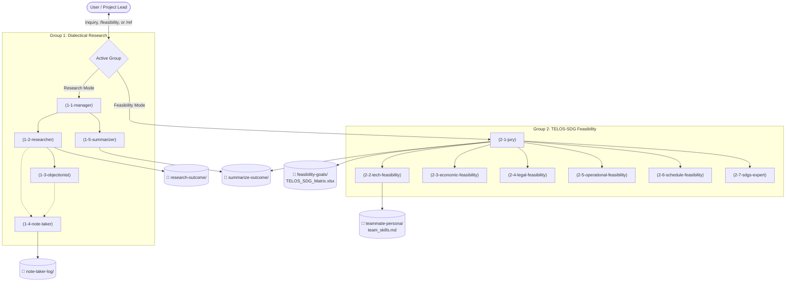

# FRA362 Custom Research & Feasibility AI Agent CLI

A dual multi-agent system designed for **Dialectical Literature Research** and **TELOS-SDG Feasibility Consulting**.

All agent SOPs, personas, and behavioral directives are defined cleanly in **Markdown** (`agents/*.md`). Output dossiers, debate transcripts, Excel matrices, and executive summaries are organized into **USA-formatted date/time subfolders** (`M-D-YYYY_HHMM-{Topic}`).

> [!NOTE]
> **Local-Only & Privacy Design**: All generated outcomes (`research-outcome/`, `note-taker-log/`, `summarize-outcome/`, `feasibility-goals/`, `teammate-persona/`) are strictly kept on your local machine and ignored by Git. This ensures that every team member runs their own AI search tools locally to manually validate findings before sharing, with zero risk of leaking private research data or API keys.

---

## Dual Multi-Agent Architecture



---

## The 12 Roles & Tag Protocol

### Group 1: Dialectical Research Team
- `(1-1-manager)`: Primary user communicator; clarifies ambiguous queries; concludes debate.
- `(1-2-researcher)`: Deep engineering source hunting with clickable live links (100% Free DuckDuckGo live web search + ArXiv open literature); produces system architectures, physical sensor specs, hydrodynamic control models ($Q = C_d \cdot b \cdot h_g \sqrt{2g \Delta h}$), and quantitative performance tables.
- `(1-3-objectionist)`: Adversarial engineering critic; quotes and highlights exact claims from sources (`> "Source claims: ..."`), contrasts them with environmental failure modes (rain fade, bio-fouling, $H_2S$ corrosion, mechanical jamming), and presents an FMEA risk matrix.
- `(1-4-note-taker)`: Continuous verbatim debate recorder in `note-taker-log/`.
- `(1-5-summarizer)`: Final engineering synthesis into HTML & Markdown in `summarize-outcome/` featuring a mandatory Quantitative Engineering Comparative Data Table.

### Group 2: TELOS-SDG Feasibility Team ("Consultors Setup Questions, Jury Takes Them All")
- `(2-1-jury)`: **Master Arbitrator & Collector**: Takes all questions proposed by the consultors, cuts off nonsense, interviews the user directly on unverified assumptions, freezes goals before scoring (anti-backpropagation rule), and compiles `TELOS_SDG_Matrix.xlsx` in `feasibility-goals/`.
- `(2-2-tech-feasibility)`: Sets up technical questions: audits actual human team capability (logged in `teammate-persona/`) and Pioneer Red Flag novelty risk.
- `(2-3-economic-feasibility)`: Sets up economic questions: evaluates whether it is worth it (constraints vs. attractiveness) with concrete benchmark examples.
- `(2-4-legal-feasibility)`: Sets up regulatory questions: statutory law, social norms, public ethics, and pending legislation.
- `(2-5-operational-feasibility)`: **Human & Team Centric**: Questions user the most regarding pre-launch workflow friction and post-launch ripple effects / 2 AM burnout.
- `(2-6-schedule-feasibility)`: Sets up timeline questions: critical-path realism, delivery guarantee conditions, and de-scoping contingency.
- `(2-7-sdgs-expert)`: **Indicator-Driven Feasibility**: Converts official **UN SDG Indicators** into exact diagnostic questions based on the [17 Modular SDG Files](sdg-rulebook/goals/README.md) across the 3 layers of the **SDG Wedding Cake** (Biosphere, Society, Economy).

---

## 📘 SDG Rulebook & Indicator Question Engine

Located in `sdg-rulebook/`:
* [**`sdg-rulebook/goals/`**](sdg-rulebook/goals/): **17 Modular Goal Files** (`goal-01.md` through `goal-17.md`) + [Routing Index](sdg-rulebook/goals/README.md). Designed for **optimal token consumption** (~1,500 tokens per evaluation instead of ~40,000 tokens) so agents only load the specific Goals relevant to the project idea. Contains all official UN Targets, Indicators (from SDG Move Thailand), and derived Feasibility Diagnostic Questions mapped to the Stockholm Resilience Centre Wedding Cake.

---

## 🇹🇭 Bilingual Fluency (Thai & English / รองรับภาษาไทย 100%)

The system natively understands and generates natural, professional Thai (ภาษาไทย):
- **Automatic Language Detection**: Prompting in Thai automatically activates Thai language directives across all 12 agents, whether using Perplexity, Gemini, OpenAI, or the offline dialectical engine.
- **Thai ArXiv Literature Discovery**: Queries in Thai (e.g. `น้ำท่วมกรุงเทพ`, `เกษตรอัจฉริยะ`) are intelligently mapped to English scientific query spaces to retrieve live, working academic papers from ArXiv.
- **Bilingual Deliverables**: Executive summaries, debate transcripts, persona logs, and feasibility reports are generated in professional Thai with English technical keywords in parentheses.
- **Safe Subfolder Naming**: Date and session subfolders safely preserve Thai unicode characters (`\u0e00-\u0e7f`).

---

## Quick Start & Setup (.venv & requirements.txt)

### 1. Create & Activate Virtual Environment (`.venv`)

**On Windows (PowerShell):**
```powershell
# Create virtual environment
python -m venv .venv

# Activate virtual environment
.venv\Scripts\Activate.ps1
```
*(If script execution is disabled on Windows, run: `Set-ExecutionPolicy -Scope Process -ExecutionPolicy Bypass`)*

**On macOS / Linux (Bash / Zsh):**
```bash
python3 -m venv .venv
source .venv/bin/activate
```

---

### 2. Install Dependencies (`requirements.txt`)
```bash
pip install -r requirements.txt
```

---

### 3. Run the CLI
```bash
python main.py
```
*(Or directly via virtual environment without activating: `.venv\Scripts\python main.py`)*

---

### 4. Key CLI Commands
* **Run Research Mode**: Simply type your topic in English or Thai (e.g. `Solid-State Batteries` หรือ `ระบบบำบัดน้ำเสียชุมชน`).
* **Run Feasibility Mode**: Type `/feasibility <your_project_idea>` (e.g. `/feasibility ประตูกั้นน้ำอัตโนมัติพลังงานแสงอาทิตย์ลุ่มน้ำเจ้าพระยา`).
* **Switch Default Mode**: Type `/mode` to toggle between `RESEARCH` and `FEASIBILITY`.
* **Reference Past Sessions**: Add `--ref <session_name>` or type `/ref`.
* **List Past Sessions**: Type `/list`.
* **Zero Cost / 100% Free**: The system uses DuckDuckGo live web scraping and ArXiv open academic papers out of the box with zero API keys required.
* **Optional Paid Keys**: Type `/key` if you ever wish to connect Perplexity, Gemini, or OpenAI.


