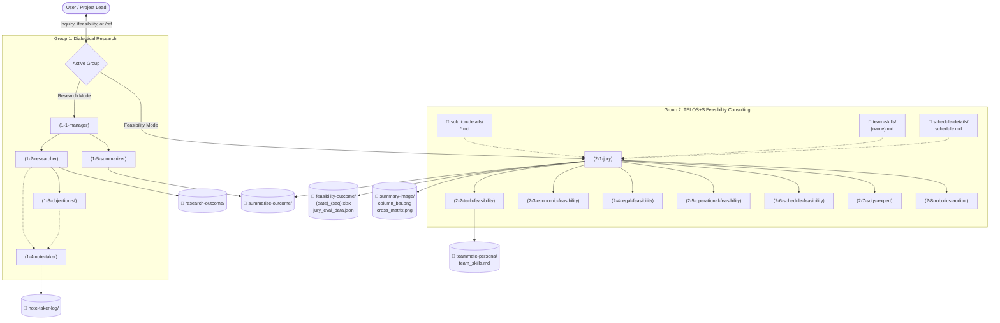

# FRA362 Custom Research & Feasibility AI Multi-Agent System

A dual multi-agent system designed for **Dialectical Literature Research** and **Systems-Thinking Robotics Feasibility Consulting (TELOS+S)**, operating directly within the AI chat interface.

All agent SOPs, personas, and behavioral directives are defined cleanly in **Markdown** (`agents/*.md`), while the SDG indicator diagnostic questions are modularized in `sdg-rulebook/goals/`.

---

## Dual Multi-Agent Architecture

---

## The 13 Roles & Tag Protocol

### Group 1: Dialectical Research Team
- `(1-1-manager)`: Primary user communicator; clarifies ambiguous queries; concludes debate.
- `(1-2-researcher)`: Deep engineering source hunting with clickable live links (100% Free DuckDuckGo live web search + ArXiv open literature); produces system architectures, physical sensor specs, hydrodynamic control models ($Q = C_d \cdot b \cdot h_g \sqrt{2g \Delta h}$), and quantitative performance tables.
- `(1-3-objectionist)`: Adversarial engineering critic; quotes and highlights exact claims from sources (`> "Source claims: ..."`), contrasts them with environmental failure modes (rain fade, bio-fouling, $H_2S$ corrosion, mechanical jamming), and presents an FMEA risk matrix.
- `(1-4-note-taker)`: Continuous verbatim debate recorder in `note-taker-log/`.
- `(1-5-summarizer)`: Final engineering synthesis into HTML & Markdown in `summarize-outcome/` featuring a mandatory Quantitative Engineering Comparative Data Table.

### Group 2: TELOS+S Feasibility Consulting Team (Systems-Thinking Robotics Audit)
- `(2-1-jury)`: **Chief Judge & Anti-Tech-Trap Gatekeeper**: Enforces the core curriculum concept from LN5 (beware focusing only on technology; all aspects interconnect). Eliminates solution-biased and overly generic questions, enforces **Standardized Problem-Space Question Anchoring** across solutions, enforces **Two-Tier Normalized Weighting** ($T=20\%, E=20\%, L=15\%, O=20\%, S=15\%, SDG=10\%$), enforces **The Knockout / Fatal-Flaw Gating Rule** (`MIN=1 -> VETOED`), and outputs `feasibility-outcome/jury_eval_data.json` or orchestrates `feasibility-analysis.py` to compile `{month}-{date}-{year}-{time}_{seq}.xlsx`.
- `(2-2-tech-feasibility)`: **Man & Machine Auditor (Weight 20%)**: Audits real tool access, fabrication skills (Mech/Elec/Prog), and the time/cost overhead that technology choices extract from the project. Flags Pioneer Novelty Risks.
- `(2-3-economic-feasibility)`: **Cost-Benefit & Financial Reality Analyst (Weight 20%)**: Evaluates funding reality, budget ceilings, scrap/iteration allowances, and true worth compared to the Zero-Action baseline (doing nothing / manual labor).
- `(2-4-legal-feasibility)`: **Institutional & Policy Gatekeeper (Weight 15%)**: Audits statutory law (PDPA, NBTC), municipal liabilities, IP infringements, and the team's verified capability to conduct in-person government agency liaisons.
- `(2-5-operational-feasibility)`: **The "Will It Actually Be Used?" Stress-Tester (Weight 20%)**: Audits dispatcher adoption, procedural resistance (e.g. Traffy Fondue photo evidence rules), workflow disruption, training burdens, and developer burnout.
- `(2-6-schedule-feasibility)`: **Conflict & Deadline Realist (Weight 15%)**: Audits milestone delivery realism against formal TRL levels (TRL2, TRL3, TRL4), stress-testing against university exam blackouts and procurement lead times.
- `(2-7-sdgs-expert)`: **Systemic Sustainability Consultant (Weight 10%)**: Evaluates multi-layer Stockholm Wedding Cake impact (Biosphere, Society, Economy), UN SDG indicators, and Do-No-Harm safeguards (preventing e-waste and vulnerability shifts).
- `(2-8-robotics-auditor)`: **FIBO Robotics Knowledge Compatibility Auditor (Orthogonal 0.0 to 10.0 Scale)**: Independently audits the **Sense-Think-Act triad** (Perception: 3.5, Processing/Algorithms: 3.5, Actuation/Mechanics: 3.0), measuring how deeply the solution leverages the institute's robotics engineering curriculum without diluting real-world TELOS+S operational viability.

---

## 📁 The 3 Structured Intake Folders

Feasibility analysis is executed against three evidence-backed intake folders:

1. **`solution-details/` (`solution-1.md`, `solution-2.md`, etc.)**: Ingests one or more solution proposals, architecture drafts, or teammate submissions. The Jury normalizes differing author writing styles and synthesizes requirements, constraints, and subsystem mechanics/electronics/programming.
2. **`team-skills/` (`{name}.md`)**: Ingests individual member profile files (e.g. `somchai.md`, `jk.md`) detailing hard skills (Mech/Elec/Prog), outreach willingness/capability, and verified past project evidence.
3. **`schedule-details/schedule.md`**: Standalone single file detailing target deadline, milestone checkpoints, component procurement windows, and manufacturing lead times.

---

## 📊 Transposed Horizontal Excel Matrix (`{month}-{date}-{year}-{time}_{seq}.xlsx`)

Compiled automatically via `feasibility-analysis.py` (Zero hardcoded questions in Python) directly into `feasibility-outcome/{month}-{date}-{year}-{time}_{seq}.xlsx` (e.g. `9-23-2026-1229_0.xlsx`):
- **Executive Comparison Tab (Sheet 1)**: Compares all evaluated solutions side-by-side with overall scores, verdicts, key strengths, critical bottlenecks, and strategic advisories.
- **Dedicated Solution Tabs (Sheets 2+)**: 1 sheet per solution formatted as a Transposed Horizontal Matrix.
- **Standardized Problem-Space Question Anchoring**: All alternative solutions are tested against the exact same diagnostic question codes and core prompts (Row 6), ensuring true apple-to-apple comparison.
- **Two-Tier Normalized Weighting**: Pillar weights are fixed ($T=20\%, E=20\%, L=15\%, O=20\%, S=15\%, SDG=10\%$), and questions within a pillar divide its weight equally so Technical cannot mathematically overshadow Operational realities.
- **The Knockout / Fatal-Flaw Gating Rule**: If any question receives a score of `1`, the entire solution is flagged as `VETOED / NON-VIABLE PENDING DE-SCOPING (ตกเกณฑ์ข้อบังคับวิกฤต / ยุติโครงการชั่วคราว)`—high scores in other pillars cannot mask fatal flaws.
- **Transposed Horizontal Inspection**: Attributes are arranged in rows (ID, Pillar, Question, Rationale, Rubric, Score, Weight, Weighted Score, Evidence, De-scoping Action) while questions are aligned horizontally across columns.
- **Dedicated Score Inspection Row**: Row 9 displays all scores parallel horizontally across the sheet.
- **Strict Discrete Integer Scoring**: All scores are whole integers chosen strictly from **`{1, 2, 3, 4, 5}`** (zero decimals, no 0.5).
- **Dynamic Normalized Total Score**: Row 9 computes `=IF(Col10>0, (Col11/Col10)*20, 0)` to dynamically normalize against the actual sum of weights, preventing score depression if total weights sum to $< 1.0$.
- **Evidence-Based Citations**: Explicitly references specific sections of intake files.
- **Deduplication Sequence Numbering**: Automatically appends `_0`, `_1`, `_2` if generated multiple times within the same minute without overwriting.

---

## 📘 SDG Rulebook & Indicator Question Engine

Located in `sdg-rulebook/`:
* [**`sdg-rulebook/goals/`**](sdg-rulebook/goals/): **17 Modular Goal Files** (`goal-01.md` through `goal-17.md`) + [Routing Index](sdg-rulebook/goals/README.md). Designed for **optimal token consumption** (~1,500 tokens per evaluation instead of ~40,000 tokens) so agents only load the specific Goals relevant to the project idea. Contains all official UN Targets, Indicators (from SDG Move Thailand), and derived Feasibility Diagnostic Questions mapped to the Stockholm Resilience Centre Wedding Cake.

---

## 🇹🇭 Bilingual Fluency (Thai & English / รองรับภาษาไทย 100%)

The system natively understands and generates natural, professional Thai (ภาษาไทย):
- **Automatic Language Detection**: Prompting in Thai automatically activates Thai language directives across all 12 agents, whether using Perplexity, Gemini, OpenAI, or the offline dialectical engine.
- **Thai ArXiv Literature Discovery**: Queries in Thai (e.g. `น้ำท่วมกรุงเทพ`, `เกษตรอัจฉริยะ`) are intelligently mapped to English scientific query spaces to retrieve live, working academic papers from ArXiv.
- **Bilingual Deliverables**: Executive summaries, debate transcripts, persona logs, and feasibility reports are generated in professional Thai with English technical keywords in parentheses.
- **Safe Subfolder Naming**: Date and session subfolders safely preserve Thai unicode characters (`\u0e00-\u0e7f`).

---

---

## 🎨 Executive Visualizations & Slides (`summary-image/`)

The system provides presentation-ready visual deliverables rendered in a clean **White-Purple Minimalist** aesthetic, compiled as both **Pure Vector SVGs** and **300 DPI Ultra-HD PNGs** ready for Canva or slide decks:

1. **3 Big Columns Comparison** ([`summary-image/telos_s_robotics_column_bar.png`](summary-image/telos_s_robotics_column_bar.png) & [`.svg`](summary-image/telos_s_robotics_column_bar.svg)):
   - **1 Big Column per Candidate Solution** side-by-side.
   - Prominently displays the **Overall Feasibility Score (out of 100)**.
   - Individual 7-pillar bar chart on a discrete **$0.0 - 5.0\text{ ★}$ scale** (`T`, `E`, `L`, `O`, `S`, `+S`, `Robotic`).
2. **Feasibility vs. Robotic Potential Cross-Matrix** ([`summary-image/feasibility_robotics_cross_matrix.png`](summary-image/feasibility_robotics_cross_matrix.png) & [`.svg`](summary-image/feasibility_robotics_cross_matrix.svg)):
   - Evaluates **Real-World Viability ($0 - 100$)** on the X-axis against **FIBO Robotics Depth ($0 - 10$)** on the Y-axis.
   - Features complete 0–10 ticks, minimal threshold lines, and 1-2-3 legend ordering.

---

## 🧠 Persistent Session Context Ledger (`CONTEXT.md`)

To guarantee continuity across restarts or session closures, the system maintains **[`CONTEXT.md`](CONTEXT.md)** at the root directory:
- Records active candidate solutions, current audited scores, and fatal flaw logs.
- Synchronizes subagent conversation IDs, prompt specifications, and file output locations.
- Read automatically whenever a new session begins to resume instantly without context loss.

---

## 🚀 In-Chat Workflow & Usage

No local terminal installation or Python scripts required. The agents operate directly within this chat interface:

### 1. Literature Research & Dialectical Debate
Simply ask any technical research topic in Thai or English:
- *Example*: `ระบบ IoT ตรวจวัดระดับน้ำและเปิดปิดประตูระบายน้ำอัตโนมัติ กรุงเทพ`
- *Process*:
  1. `(1-1-manager)` validates and clarifies scope if ambiguous.
  2. `(1-2-researcher)` performs live web searches, pulls engineering specs, formulas ($Q = C_d \cdot b \cdot h_g \sqrt{2g \Delta h}$), and empirical performance matrices.
  3. `(1-3-objectionist)` quotes highlighted claims from sources, identifies physical failure modes (rain fade, H₂S degradation, mechanical jams), and generates an **FMEA Matrix**.
  4. `(1-5-summarizer)` synthesizes the findings into a **Quantitative Engineering Comparative Data Table** and a 3-phase Go/No-Go roadmap.

### 2. Systems-Thinking TELOS+S Feasibility Consulting
Provide project files in the 3 intake folders (`solution-details/`, `team-skills/`, `schedule-details/`), then trigger the feasibility evaluation:
- *Trigger*: `/feasibility` or `ประเมินความเป็นไปได้จากโฟลเดอร์ intake`
- *Process*:
  1. `(2-1-jury)` reads the 3 intake files, eliminates solution-biased and generic questions, and broadcasts facts.
  2. The 7 Feasibility Specialists (`2.2` to `2.8`) audit Man & Machine capabilities, funding reality vs. zero-action, statutory policy, operational dispatcher adoption, exam conflicts, systemic SDGs, and FIBO robotics compatibility.
  3. `(2-1-jury)` compiles `feasibility-outcome/jury_eval_data.json` and runs `feasibility-analysis.py` to compile the final `.xlsx` workbook.
  4. `generate_summary_images.py` automatically updates and exports the executive SVGs and 300 DPI PNGs in `summary-image/`.
