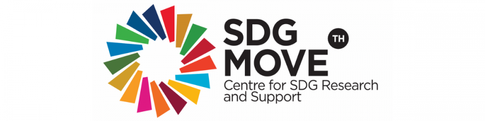

# เป้าหมายย่อย และตัวชี้วัด | SDG Move

[https://www.sdgmove.com/%e0%b9%80%e0%b8%9b%e0%b9%89%e0%b8%b2%e0%b8%ab%e0%b8%a1%e0%b8%b2%e0%b8%a2%e0%b8%a2%e0%b9%88%e0%b8%ad%e0%b8%a2-%e0%b9%81%e0%b8%a5%e0%b8%b0%e0%b8%95%e0%b8%b1%e0%b8%a7%e0%b8%8a%e0%b8%b5%e0%b9%89/](https://www.sdgmove.com/%e0%b9%80%e0%b8%9b%e0%b9%89%e0%b8%b2%e0%b8%ab%e0%b8%a1%e0%b8%b2%e0%b8%a2%e0%b8%a2%e0%b9%88%e0%b8%ad%e0%b8%a2-%e0%b9%81%e0%b8%a5%e0%b8%b0%e0%b8%95%e0%b8%b1%e0%b8%a7%e0%b8%8a%e0%b8%b5%e0%b9%89/)

## Goal 1
No Poverty

**เป้าหมายที่ 1:** ยุติความยากจนทุกรูปแบบในทุกที่ (End poverty in all its forms everywhere) ว่าด้วยการลดความยากจนทั้งทางเศรษฐกิจ และความยากจนในมิติอื่น ๆ ด้วย (ตามการนิยามของแต่ละประเทศ) ครอบคลุมคนทุกกลุ่ม ทั้งชาย หญิง เด็ก คนยากจน และกลุ่มคนเปราะบาง

เป้าหมายย่อยของเป้าหมายนี้ครอบคลุมประเด็นการยกระดับรายได้ของผู้คนให้สูงกว่า $1.25 ต่อวัน (1.1) และลดสัดส่วนของความยากจนในมิติต่าง ๆ ของคนทุกกลุ่มให้เหลือครึ่งหนึ่งภายในปีพ.ศ. 2573 (1.2) เน้นการใช้ระบบและมาตรการคุ้มครองทางสังคม (1.3) และการสร้างหลักประกันในเรื่องสิทธิของการเข้าถึงทรัพยากรทางเศรษฐกิจ บริการพื้นฐาน รวมถึงกรรมสิทธิ์เหนือที่ดินและทรัพย์สิน (1.4) นอกจากนี้ยังให้ความสำคัญกับการสร้างภูมิต้านทานให้กับคนยากจนและเปราะบางจากภัยพิบัติต่าง ๆ ทั้งทางเศรษฐกิจสังคม และที่เกี่ยวข้องกับสภาพภูมิอากาศด้วย

ในทางนโยบาย เป้าหมายนี้จะเน้นให้มีการให้ความช่วยเหลือระหว่างประเทศ โดยการระดมทรัพยากรที่หลากหลายไปช่วยประเทศที่พัฒนาน้อยกว่า เพื่อลงทุนในโครงการที่จะยุติความยากจน (1.a) และกำหนดนโยบายในระดับต่าง ๆ โดยคำนึงถึงความละเอียดอ่อนด้านเพศสภาพและความยากจน (1.b)

## เป้าหมายย่อยภายใต้ เป้าหมายที่ 1

**เป้าหมายย่อย 1.1** ขจัด[ความยากจนขั้นรุนแรง](https://www.sdgmove.com/2021/05/04/sdg-vocab-extreme-poverty/)ของประชาชนในทุกพื้นที่ให้หมดไปภายในปี พ.ศ. 2573 ซึ่งปัจจุบันความยากจนวัดจากคนที่มีค่าใช้จ่ายดำรงชีพรายวันต่ำกว่า $1.90 ต่อวัน

**เป้าหมายย่อย 1.2** ภายในปี พ.ศ. 2573 ลดสัดส่วน ชาย หญิง และเด็ก ในทุกช่วงวัย ที่อยู่ภายใต้ความยากจนในทุกมิติ ตามนิยามของแต่ละประเทศ ให้ลดลงอย่างน้อยครึ่งหนึ่ง

**เป้าหมายย่อย 1.3** ดำเนินการให้ทุกคนมีระบบและมาตรการ[การคุ้มครองทางสังคม](https://www.sdgmove.com/2021/05/06/sdg-vocab-02-social-protection/)ระดับประเทศที่เหมาะสม ซึ่งรวมถึงฐาน การคุ้มครองทางสังคม (floors) โดยให้ครอบคลุมกลุ่มประชากรยากจน และกลุ่มเปราะบางให้มากพอ ภายในปี พ.ศ. 2573

**เป้าหมายย่อย 1.4** ภายในปี พ.ศ. 2573 สร้างหลักประกันว่าชายและหญิงทุกคน โดยเฉพาะผู้ที่ยากจนและเปราะบาง มีสิทธิเท่าเทียมกันในทรัพยากรทางเศรษฐกิจ รวมถึงการเข้าถึง[บริการขั้นพื้นฐาน](https://www.sdgmove.com/2021/05/08/sdg-vocab-basic-services/) การเป็นเจ้าของและมีสิทธิในที่ดินและทรัพย์สินในรูปแบบอื่น มรดก ทรัพยากรธรรมชาติ เทคโนโลยีใหม่ที่เหมาะสม และบริการทางการเงิน ซึ่งรวมถึงระบบการเงินระดับฐานราก (microfinance)

**เป้าหมายย่อย 1.5** ภายในปี พ.ศ. 2573 สร้างภูมิต้านทานให้กับผู้ที่ยากจนและอยู่ในสถานการณ์เปราะบาง รวมทั้งลดความเสี่ยงและความล่อแหลมต่อภาวะสภาพอากาศผันผวนรุนแรง การเปลี่ยนแปลงอย่างรุนแรงทางเศรษฐกิจ สังคมและสิ่งแวดล้อม และภัยพิบัติ

**เป้าหมายย่อย 1.a** สร้างหลักประกันว่าจะมีการระดมทรัพยากรอย่าง มีนัยสำคัญจากแหล่งที่หลากหลาย รวมไปถึงการยกระดับ ความร่วมมือเพื่อการพัฒนา เพื่อให้ประเทศกำลังพัฒนา โดยเฉพาะอย่างยิ่งประเทศพัฒนาน้อยที่สุด มีวิธีการที่เพียงพอและคาดการณ์ได้ในการดำเนินงานตามแผนงานและนโยบายเพื่อยุติความยากจนในทุกมิติ

- อ้างอิงชื่อเป้าหมายและเป้าหมายย่อยภาษาไทยจากสำนักงานคณะกรรมการพัฒนาการเศรษฐกิจและสังคมแห่งชาติ (สศช.)

## Goal 2 
Zero Hunger

**เป้าหมายที่ 2 :** ยุติความหิวโหย บรรลุ[ความมั่นคงทางอาหาร](https://www.sdgmove.com/venture/2021/05/11/sdg-vocab-food-security/)และยกระดับโภชนาการ และส่งเสริมเกษตรกรรมที่ยั่งยืน (End hunger, achieve food security and improved nutrition and promote sustainable agriculture) มีเป้าหมายย่อยครอบคลุมประเด็นต่าง ๆ ตั้งแต่การเข้าถึงอาหารปลอดภัยและมีโภชนาการ (2.1) ยุติภาวะทุพโภชนาการ (2.2) เพิ่มผลิตภาพและการเข้าถึงทรัพยากรและโอกาสต่าง ๆ ของเกษตรกรรายย่อย ซึ่งรวมถึงผู้หญิง คนพื้นเมือง เกษตรกรที่ทำกินในครัวเรือนแบบยังชีพ คนเลี้ยงปศุสัตว์และประมงพื้นบ้าน (2.3) เกษตรกรรมที่ยั่งยืนและปรับตัวต่อการเปลี่ยนแปลงสภาพภูมิอากาศ และช่วยพัฒนาคุณภาพดินได้ (2.4) และความหลากหลายทางพันธุกรรม การเข้าถึง ใช้ประโยชน์ และแบ่งปันผลประโยชน์ที่เกิดขึ้นอย่างเท่าเทียมและเป็นธรรม (2.5)ในเชิงนโยบาย

เป้าหมายที่ 2 เน้นไปที่การลงทุนในโครงสร้างพื้นฐานที่เกี่ยวกับการเกษตรในประเทศกำลังพัฒนา (2.a) การทำให้ตลาดสินค้าเกษตรโลกมีความเสรีและเป็นธรรม (2.b) และการลดความผันผวนราคาอาหารโดยการทำให้ตลาดโภคภัณฑ์อาหารและตลาดอนุพันธ์ทำงานได้อย่างเหมาะสม (2.c)

## เป้าหมายย่อยภายใต้ เป้าหมายที่ 2

**เป้าหมายย่อย 2.1** ยุติความหิวโหยและสร้างหลักประกันให้ทุกคนโดยเฉพาะคนที่ยากจนและอยู่ในภาวะเปราะบาง อันรวมถึงทารก ได้เข้าถึงอาหารที่ปลอดภัย มีโภชนาการ และเพียงพอตลอดทั้งปี ภายในปีพ.ศ. 2573

**เป้าหมายย่อย 2.2** ยุติ[ภาวะทุพโภชนา](https://www.sdgmove.com/2021/05/13/sdg-vocab-05-malnutrition/)การทุกรูปแบบและแก้ไขปัญหาความต้องการสารอาหารของหญิงวัยรุ่น หญิงตั้งครรภ์และให้นมบุตร และผู้สูงอายุ ภายในปี พ.ศ. 2573 รวมถึงบรรลุเปูาหมายที่ตกลงร่วมกันระหว่างประเทศว่าด้วยภาวะเตี้ย (stunting) และแคระแกร็น (wasting) ในเด็กอายุต่ำกว่า 5 ปี ภายในปี พ.ศ. 2568

**เป้าหมายย่อย 2.3** เพิ่มผลิตภาพทางการเกษตรและรายได้ของผู้ผลิตอาหารรายเล็ก โดยเฉพาะผู้หญิง คนพื้นเมือง ครัวเรือนเกษตรกร เกษตรกรผู้เลี้ยงสัตว์ และชาวประมง ให้เพิ่มขึ้นเป็น 2 เท่า โดยรวมถึงการเข้าถึงที่ดิน ทรัพยากรและปัจจัยการผลิต ความรู้ บริการทางการเงิน ตลาด และโอกาสสำหรับการเพิ่มมูลค่าและการจ้างงานนอกฟาร์ม อย่างมั่นคงและเท่าเทียม ภายในปี พ.ศ. 2573

**เป้าหมายย่อย 2.4**  สร้างหลักประกันว่าจะมีระบบการผลิตอาหารที่ยั่งยืนและดำเนินการตาม[แนวปฏิบัติทางการเกษตรที่มีภูมิคุ้มกัน](https://www.sdgmove.com/2021/05/15/sdg-vocab-06-sustainable-agriculture/) ที่จะเพิ่มผลิตภาพและการผลิต ซึ่งจะช่วยรักษาระบบนิเวศ เสริมขีดความสามารถในการปรับตัวต่อการเปลี่ยนแปลงสภาพภูมิอากาศ ภาวะอากาศรุนแรง ภัยแล้ง อุทกภัย และภัยพิบัติอื่น ๆ และจะช่วยพัฒนาคุณภาพของดินและที่ดินอย่างต่อเนื่อง ภายในปี พ.ศ. 2573

**เป้าหมายย่อย 2.5** คงความหลากหลายทางพันธุกรรมของเมล็ดพันธุ์พืชที่ใช้เพาะปลูก สัตว์ในไร่นาและที่เลี้ยงตามบ้านเรือน และชนิดพันธุ์ตามธรรมชาติที่เกี่ยวข้องกับพืชและสัตว์เหล่านั้น รวมถึงให้มีธนาคารพืชและเมล็ดพันธุ์ที่มีการจัดการที่ดี และมีความหลากหลาย ทั้งในระดับประเทศ ระดับภูมิภาค และระดับนานาชาติและสร้างหลักประกันว่าจะมีการเข้าถึงและแบ่งปันผลประโยชน์อันเกิดจากการใช้ทรัพยากรทางพันธุกรรม และองค์ความรู้ท้องถิ่นที่เกี่ยวข้องอย่างเป็นธรรมและเท่าเทียม ตามที่ตกลงกันระหว่างประเทศ ภายในปี พ.ศ. 2563

**เป้าหมายย่อย 2.a** เพิ่มการลงทุน ตลอดจนยกระดับความร่วมมือระหว่างประเทศในเรื่องโครงสร้างพื้นฐานในชนบท การวิจัยและส่งเสริมการเกษตร การพัฒนาเทคโนโลยี และการทำธนาคารเชื้อพันธุ์ (gene bank) ของพืชและสัตว์ เพื่อยกระดับขีดความสามารถในการผลิตสินค้าเกษตรในประเทศกำลังพัฒนา โดยเฉพาะอย่างยิ่งในประเทศพัฒนาน้อยที่สุด

**เป้าหมายย่อย 2.b** แก้ไขและป้องกันการกีดกันและการบิดเบือนทางการค้าในตลาดเกษตรโลก รวมถึงการดำเนินการคู่ขนาดไปกับการขจัดการอุดหนุนการส่งออกสินค้าเกษตรทุกรูปแบบและมาตรการเพื่อการส่งออกทุกแบบที่ให้ผลในลักษณะเดียวกัน โดยให้เป็นไปตามอาณัติของรอบการพัฒนาโดฮา

**เป้าหมายย่อย 2.c** เลือกใช้มาตรการที่สร้างหลักประกันได้ว่าตลาดโภคภัณฑ์อาหารและตลาดอนุพันธ์สามารถทำงานได้อย่างเหมาะสม และอำนวยความสะดวกในการเข้าถึงข้อมูลของตลาดและข้อมูลสำรองอาหารได้อย่างทันการณ์ เพื่อจำกัดความผันผวนของราคาอาหารที่รุนแรง

- อ้างอิงชื่อเป้าหมายและเป้าหมายย่อยภาษาไทยจากสำนักงานคณะกรรมการพัฒนาการเศรษฐกิจและสังคมแห่งชาติ (สศช.)

## Goal 3 
Good Health and Well-being

**เป้าหมายที่ 3 สร้างหลักประกันการมีสุขภาวะที่ดี และส่งเสริมความเป็นอยู่ที่ดีสำหรับทุกคนในทุกช่วงวัย (Ensure healthy lives and promote well-being for all at all ages)** มีเป้าหมายย่อยครอบคลุมประเด็นด้านสุขภาวะและความเป็นอยู่ที่ดีหลายประเด็น ตั้งแต่การลดอัตราการตายของมารดาทั่วโลก (3.1) ยุติการตายที่ป้องกันได้ของทารกแรกเกิด (3.2) ยุติการแพร่ระบาดของเอดส์ วัณโรค มาลาเรีย และโรคเขตร้อน (3.3) ลดการตายก่อนวัยอันควรจากโรคไม่ติดต่อ (3.4) ประเด็นเรื่องยาเสพติดและแอลกอฮอล์ (3.5) การตายและบาดเจ็บจากอุบัติเหตุทางถนน (3.6) อนามัยการเจริญพันธุ์และการวางแผนครอบครัว (3.7) การเข้าถึงบริการสาธารณสุขและป้องกันความเสี่ยงทางการเงิน (3.8) และลดการตายและป่วยจากสารเคมีอันตรายและจากการปนเปื้อนและมลพิษต่าง ๆ (3.9)

ในทางนโยบาย เป้าหมายที่ 3 จะเน้นไปที่การปฏิบัติตามกรอบอนุสัญญาขององค์การอนามัยโลก โดยเฉพาะเรื่องยาสูบ (3.a) การวิจัยและพัฒนายาและวัคซีน และการเข้าถึงยาและวัคซีนถ้วนหน้าผ่านการผ่อนปรนบทบัญญัติเกี่ยวกับทรัพย์สินทางปัญญาเพื่อให้คนในประเทศกำลังพัฒนาเข้าถึงยาได้ (3.b) สร้างและรักษากำลังคนด้านสุขภาพ (3.c) และเสริมขีดความสามารถในการแจ้งเตือนล่วงหน้า การลดความเสี่ยง และการบริหารจัดการความเสี่ยงด้านสุขภาพ (3.d)

## เป้าหมายย่อยภายใต้ เป้าหมายที่ 3

**เป้าหมายย่อย 3.1** ลดอัตราการตายของมารดาทั่วโลกให้ต่ำกว่า 70 คน ต่อการเกิดมีชีพ 100,000 คน ภายในปี พ.ศ. 2573

**เป้าหมายย่อย 3.2** ยุติการตายที่ป้องกันได้ของทารกแรกเกิดและเด็กอายุต่ำกว่า 5 ปี โดยทุกประเทศมุ่งลดอัตราการตายในทารกลงให้ต่ำถึง 12 คน ต่อการเกิดมีชีพ 1,000 คน และลดอัตราการตายในเด็กอายุต่ำกว่า 5 ปี ลงให้ต่ำถึง 25 คน ต่อการเกิดมีชีพ 1,000 คน ภายในปี พ.ศ. 2573

**เป้าหมายย่อย 3.3** ยุติการแพร่กระจายของเอดส์ วัณโรค มาลาเรีย และโรคเขตร้อนที่ถูกละเลย และต่อสู้กับโรคตับอักเสบ โรคติดต่อทางน้ำและโรคติดต่ออื่นๆ ภายในปี พ.ศ. 2573

**เป้าหมายย่อย 3.4** ลดการตายก่อนวัยอันควรจากโรคไม่ติดต่อให้ลดลงหนึ่งในสาม ผ่านทางการป้องกันและการรักษาโรค และสนับสนุนสุขภาพจิตและความเป็นอยู่ที่ดี ภายในปี พ.ศ. 2573

**เป้าหมายย่อย 3.5** เสริมสร้างการป้องกันและการรักษาการใช้สารในทางที่ผิซึ่งรวมถึงการใช้ยาเสพติดในทางที่ผิด และการใช้แอลกอฮอล์ในทางที่เป็นอันตราย

**เป้าหมายย่อย 3.6** ลดจำนวนการตายและบาดเจ็บจากอุบัติเหตุจากการจราจรทางถนนทั่วโลกลงครึ่งหนึ่ง ภายในปี พ.ศ. 2563

**เป้าหมายย่อย 3.7** สร้างหลักประกันถ้วนหน้า ในการเข้าถึงบริการสุขภาวะทางเพศและอนามัยการเจริญพันธุ์ รวมถึงการวางแผนครอบครัว ข้อมูลข่าวสารและความรู้ และการบูรณาการอนามัยการเจริญพันธุ์ในยุทธศาสตร์และแผนงานระดับชาติ ภายในปี พ.ศ. 2573

**เป้าหมายย่อย 3.8** บรรลุการมีหลักประกันสุขภาพถ้วนหน้า รวมถึงการป้องกันความเสี่ยงทางการเงิน การเข้าถึงการบริการสาธารณสุขจำเป็นที่มีคุณภาพ และเข้าถึงยาและวัคซีนจำเป็นที่ปลอดภัย มีประสิทธิภาพ มีคุณภาพ และมีราคาที่สามารถซื้อหาได้

**เป้าหมายย่อย 3.9** ลดจำนวนการตายและการเจ็บป่วยจากสารเคมีอันตรายและจากมลพิษและการปนเปื้อนทางอากาศ น้ำ และดิน ให้ลดลงอย่างมาก ภายในปี พ.ศ. 2573

**เป้าหมายย่อยที่ 3.a** เพิ่มความเข้มแข็งในการดำเนินงานตามกรอบอนุสัญญาขององค์การอนามัยโลกว่าด้วยการควบคุมยาสูบ ในทุกประเทศตามความเหมาะสม

**เป้าหมายย่อย 3.b** สนับสนุนการวิจัยและการพัฒนาวัคซีนและยาสำหรับโรคติดต่อและไม่ติดต่อที่ส่งผลกระทบโดยตรงต่อประเทศกำลังพัฒนา ให้มีการเข้าถึงยาและวัคซีนจำเป็นในราคาที่สามารถซื้อหาได้ตามปฏิญญาโดฮาว่าด้วยความตกลงทรัพย์สินทางปัญญาที่เกี่ยวข้องกับการค้า (TRIPS) และการสาธารณสุข ซึ่งเน้นย้ำสิทธิสำหรับประเทศกำลังพัฒนาที่จะใช้บทบัญญัติในความตกลง TRIPS อย่างเต็มที่ในเรื่องการผ่อนปรนเพื่อจะปกป้องสุขภาพสาธารณะและโดยเฉพาะการเข้าถึงยาโดยถ้วนหน้า

**เป้าหมายย่อย 3.c** เพิ่มการใช้เงินสนับสนุนด้านสุขภาพ และการสรรหา การพัฒนา การฝึกฝน และการเก็บรักษากำลังคนด้านสุขภาพในประเทศกำลังพัฒนา โดยเฉพาะอย่างยิ่งในประเทศพัฒนาน้อยที่สุดและรัฐกำลังพัฒนาที่เป็นเกาะขนาดเล็ก

**เป้าหมายย่อย 3.d** เสริมขีดความสามารถของทุกประเทศ โดยเฉพาะอย่างยิ่งประเทศกำลังพัฒนา ในด้านการแจ้งเตือนล่วงหน้า การลดความเสี่ยง และการบริหารจัดการความเสี่ยงด้านสุขภาพทั้งในระดับประเทศและระดับโลก

- อ้างอิงชื่อเป้าหมายและเป้าหมายย่อยภาษาไทยจากสำนักงานคณะกรรมการพัฒนาการเศรษฐกิจและสังคมแห่งชาติ (สศช.)

## Goal 4 
Quality Education

**เป้าหมายที่ 4: สร้างหลักประกันว่าทุกคนมีการศึกษาที่มีคุณภาพอย่างครอบคลุมและเท่าเทียม และสนับสนุนโอกาสในการเรียนรู้ตลอดชีวิต (Ensure inclusive and equitable quality education and promote lifelong learning opportunities for all)** มีเป้าหมายย่อยครอบคลุมการเข้าถึงการศึกษาที่มีคุณภาพของเด็กชายและเด็กหญิงในทุกระดับ ตั้งแต่ระดับปฐมวัย (4.2) ระดับประถมศึกษาและมัธยมศึกษา (4.1) การเข้าถึงการศึกษาระดับเทคนิค อาชีวศึกษา อุดมศึกษา รวมถึงมหาวิทยาลัยที่จ่ายได้และมีคุณภาพสำหรับชายและหญิงทุกคน (4.3) และในภาพรวมเยาวชนทุกคนและผู้ใหญ่ส่วนใหญ่สามารถอ่านออกเขียนได้และคำนวณได้ (4.6) เน้นให้ขจัดความเหลื่อมล้ำทางเพศในการศึกษา และการเข้าถึงการศึกษาของผู้พิการ ชนพื้นเมือง และกลุ่มเปราะบาง (4.5)

นอกจากนี้เป้าหมายนี้ยังส่งเสริมให้เพิ่มจำนวนผู้ที่มีทักษะทางเทคนิคและอาชีพสำหรับการจ้างงาน และการเป็นผู้ประกอบการ (4.4) และเน้นให้ทุกคนได้รับความรู้และทักษะที่จำเป็นสำหรับส่งเสริมการพัฒนาที่ยั่งยืนอีกด้วย (4.7)

ในเชิงนโยบาย เป้าหมายนี้จะเน้นให้มีการยกระดับอุปกรณ์ที่จำเป็นในการศึกษาที่คำนึงถึงเด็ก ผู้พิการ และผู้มีเพศสภาวะหลากหลาย และสร้างสภาพแวดล้อมให้ปราศจากความรุนแรงต่อกลุ่มเหล่านี้ (4.a) ขยายโอกาสด้านทุนการศึกษาและการฝึกอบรมทั้งในประเทศและระหว่างประเทศ (4.b) และเพิ่มจำนวนครูที่มีคุณภาพผ่านความร่วมมือระหว่างประเทศ

## เป้าหมายย่อยภายใต้ เป้าหมายที่ 4

**เป้าหมายย่อย 4.1** สร้างหลักประกันว่าเด็กชายและเด็กหญิงทุกคนสำเร็จการศึกษาระดับประถมศึกษาและมัธยมศึกษาที่มีคุณภาพ [เท่าเทียม](https://www.sdgmove.com/2021/05/25/sdg-vocab-10-equitable-education/) และไม่มีค่าใช้จ่าย นำไปสู่ผลลัพธ์ทางการเรียนที่มีประสิทธิผล ภายในปี พ.ศ. 2573

**เป้าหมายย่อย 4.2** สร้างหลักประกันว่าเด็กชายและเด็กหญิงทุกคนเข้าถึงการพัฒนา การดูแล และการจัดการศึกษาระดับก่อนประถมศึกษา สำหรับเด็กปฐมวัยที่มีคุณภาพ เพื่อให้เด็กเหล่านั้นมีความพร้อมสำหรับการศึกษาระดับประถมศึกษา ภายในปี พ.ศ. 2573

**เป้าหมายย่อย 4.3** สร้างหลักประกันให้ชายและหญิงทุกคนเข้าถึงการศึกษา อาชีวศึกษา อุดมศึกษา รวมถึงมหาวิทยาลัยที่มีคุณภาพ ในราคาที่สามารถจ่ายได้ ภายในปี พ.ศ. 2573

**เป้าหมายย่อย 4.4** เพิ่มจำนวนเยาวชนและผู้ใหญ่ที่มีทักษะที่เกี่ยวข้องจำเป็น รวมถึงทักษะทางด้านเทคนิคและอาชีพสำหรับการจ้างงาน การมีงานที่มีคุณค่า และการเป็นผู้ประกอบการ ภายในปี พ.ศ. 2573

**เป้าหมายย่อย 4.5** ขจัดความเหลี่อมล้ำทางเพศด้านการศึกษา และสร้างหลักประกันว่ากลุ่มที่เปราะบางซึ่งรวมถึงผู้พิการ ชนพื้นเมือง และเด็ก เข้าถึงการศึกษาและการฝึกอาชีพทุกระดับอย่างเท่าเทียม ภายในปี พ.ศ. 2573

**เป้าหมายย่อย 4.6** สร้างหลักประกันว่าเยาวชนทุกคนและผู้ใหญ่ทั้งชายและหญิงในสัดส่วนสูง สามารถ[อ่านออกเขียนได้และคำนวณได้](https://www.sdgmove.com/2021/05/25/sdg-vocab-10-equitable-education/) ภายในปี พ.ศ. 2573

**เป้าหมายย่อย 4.7** สร้างหลักประกันว่าผู้เรียนทุกคนได้รับความรู้และทักษะที่จาเป็นสำหรับส่งเสริมการพัฒนาที่ยั่งยืน รวมไปถึง [การศึกษาสำหรับการพัฒนาที่ยั่งยืน](https://www.sdgmove.com/2021/05/29/sdg-vocab-12-education-for-sustainable-development/)และการมีวิถีชีวิตที่ยั่งยืน สิทธิมนุษยชน ความเสมอภาคระหว่างเพศ การส่งเสริมวัฒนธรรมแห่งความสงบสุขและการไม่ใช้ความรุนแรง การเป็นพลเมืองของโลก และความชื่นชมในความหลากหลายทางวัฒนธรรมและการที่วัฒนธรรมมีส่วนช่วยให้เกิดการพัฒนาที่ยั่งยืน ภายในปี พ.ศ. 2573

**เป้าหมายย่อย 4.a** สร้างและยกระดับสถานศึกษา ตลอดจนเครื่องมือและอุปกรณ์การศึกษาที่อ่อนไหวต่อเด็ก ผู้พิการ และเพศภาวะ และจัดให้มีสภาพแวดล้อมทางการเรียนรู้ที่ปลอดภัย ปราศจากความรุนแรง ครอบคลุมและมีประสิทธิผลสำหรับทุกคน

**เป้าหมายย่อย 4.b** เพิ่มจำนวนทุนการศึกษาทั่วโลกที่ให้แก่ประเทศกาลังพัฒนา โดยเฉพาะประเทศพัฒนาน้อยที่สุด รัฐกำลังพัฒนาที่เป็นเกาะขนาดเล็ก และประเทศในทวีปแอฟริกา เพื่อเข้าศึกษาต่อในระดับอุดมศึกษา รวมถึงการฝึกอาชีพ และโปรแกรมด้านเทคโนโลยีสารสนเทศและการสื่อสาร ด้านเทคนิค วิศวกรรม และวิทยาศาสตร์ ในประเทศพัฒนาแล้วและประเทศกำลังพัฒนาอื่นๆ ภายในปี พ.ศ. 2563

**เป้าหมายย่อย 4.c** เพิ่มจำนวนครูที่มีคุณวุฒิ รวมถึงการดาเนินการผ่านความร่วมมือระหว่างประเทศในการฝึกอบรมครูในประเทศกำลังพัฒนา โดยเฉพาะอย่างยิ่งในประเทศพัฒนาน้อยที่สุด และรัฐกำลังพัฒนาที่เป็นเกาะขนาดเล็ก ภายในปี พ.ศ. 2573

- อ้างอิงชื่อเป้าหมายและเป้าหมายย่อยภาษาไทยจากสำนักงานคณะกรรมการพัฒนาการเศรษฐกิจและสังคมแห่งชาติ (สศช.)

## Goal 5 
Gender Equality

**เป้าหมายที่ 5: บรรลุความเสมอภาคระหว่างเพศ และเพิ่มบทบาทของสตรีและเด็กหญิงทุกคน (Achieve gender equality and empower all women and girls)** มีเป้าหมายย่อยครอบคลุมประเด็นการยุติการเลือกปฏิบัติ และขจัดความรุนแรงทุกรูปแบบต่อผู้หญิงและเด็กหญิง (5.1, 5.2 และ 5.3) ยอมรับและให้คุณค่าต่อการดูแลและทำงานบ้านแบบไม่ได้รับค่าจ้าง (5.4) การมีส่วนร่วมอย่างเต็มที่และมีประสิทธิผลในการเป็นผู้นำและการตัดสินใจในทุกระดับ (5.5) การเข้าถึงสุขภาวะทางเพศและอนามัยการเจริญพันธุ์โดยถ้วนหน้า

ในเชิงนโยบาย เป้าหมายนี้เน้นว่าควรมีการดำเนินการปฏิรูปเพื่อให้ผู้หญิงมีสิทธิเท่าเทียมกันในทรัพยากรทางเศรษฐกิจ (5.a) และความเสมอภาคทางเพศด้านอื่น ๆ ในทุกระดับ (5.c) เพิ่มพูนการใช้เทคโนโลยีที่ส่งเสริมผู้หญิงและเด็กหญิง (5.b)

## เป้าหมายย่อยภายใต้ เป้าหมายที่ 5

**เป้าหมายย่อย 5.1** ยุติการเลือกปฏิบัติทุกรูปแบบที่มีต่อผู้หญิงและเด็กหญิงในทุกที่

**เป้าหมายย่อย 5.2** ขจัดความรุนแรงทุกรูปแบบที่มีต่อผู้หญิงและเด็กหญิงทั้งในที่สาธารณะและที่รโหฐาน รวมถึงการค้ามนุษย์ การแสวงประโยชน์ทั้งทางเพศ และในรูปแบบอื่น

**เป้าหมายย่อย 5.3** ขจัดแนวปฏิบัติที่เป็นภัยทุกรูปแบบ อาทิ [การแต่งงานในเด็กก่อนวัยอันควร](https://www.sdgmove.com/2021/05/31/sdg-vocab-13-child-early-and-forced-marriage-cefm/)และโดยการบังคับ และการทำลายอวัยวะเพศหญิง

**เป้าหมายย่อย 5.4** ตระหนักและให้คุณค่าต่อ[การดูแลและการทำงานบ้านแบบไม่ได้รับค่าจ้าง](https://www.sdgmove.com/2021/06/03/sdg-vocab-14-unpaid-care-work/) โดยจัดให้มีบริการสาธารณะ โครงสร้างพื้นฐานและนโยบายการคุ้มครองทางสังคม และสนับสนุนความรับผิดชอบร่วมกันภายในครัวเรือนและครอบครัว ตามความเหมาะสมของแต่ละประเทศ

**เป้าหมายย่อย 5.5** สร้างหลักประกันว่าผู้หญิงจะมีส่วนร่วมอย่างเต็มที่และมีประสิทธิผล และมีโอกาสที่เท่าเทียมในการเป็นผู้นำในทุกระดับของการตัดสินใจในเรื่องการเมือง เศรษฐกิจ และสาธารณะ

**เป้าหมายย่อย 5.6** สร้างหลักประกันว่าจะมีการเข้าถึง[สุขภาวะทางเพศและอนามัยการเจริญพันธุ์](https://www.sdgmove.com/2021/06/05/sdg-vocab-15-sexual-and-reproductive-health/) และสิทธิด้านการเจริญพันธุ์โดยถ้วนหน้า ตามที่ตกลงในแผนปฏิบัติการของการประชุมนานาชาติว่าด้วยประชากรและการพัฒนา และแผนปฏิบัติการปักกิ่งและเอกสารผลลัพธ์ของการประชุมทบทวนเหล่านั้น

**เป้าหมายย่อย 5.a** ดำเนินการปฏิรูปเพื่อให้ผู้หญิงมีสิทธิที่เท่าเทียมในทรัพยากรทางเศรษฐกิจ รวมทั้ง การเข้าถึงการเป็นเจ้าของและมีสิทธิในที่ดิน และทรัพย์สินในรูปแบบอื่น การบริการทางการเงิน การรับมรดก และทรัพยากรธรรมชาติ ตามกฎหมายของประเทศ

**เป้าหมายย่อย 5.b** เพิ่มพูนการใช้เทคโนโลยี โดยเฉพาะเทคโนโลยีสารสนเทศและการสื่อสารเพื่อเพิ่มบทบาทแก่สตรี

**เป้าหมายย่อย 5.c** เลือกใช้และเสริมความเข้มแข็งแก่นโยบายที่ดีและกฎระเบียบที่บังคับใช้ได้ เพื่อส่งเสริมความเสมอภาคระหว่างเพศและการเพิ่มบทบาทแก่ผู้หญิงและเด็กหญิงทุกคนในทุกระดับ

- อ้างอิงชื่อเป้าหมายและเป้าหมายย่อยภาษาไทยจากสำนักงานคณะกรรมการพัฒนาการเศรษฐกิจและสังคมแห่งชาติ (สศช.)

## Goal 6 
Clean Water and Sanitation

**เป้าหมายที่ 6: สร้างหลักประกันเรื่องน้ำและการสุขาภิบาล ให้มีการจัดการอย่างยั่งยืนและมีสภาพพร้อมใช้ สำหรับทุกคน (Ensure availability and sustainable management of water and sanitation for all)** มีเป้าหมายย่อยครอบคลุมประเด็นที่เกี่ยวข้องกับ การเข้าถึงน้ำดื่มที่ปลอดภัย (6.1) การเข้าถึงสุขอนามัยที่พอเพียงและเป็นธรรม และยุติการขับถ่ายในที่โล่ง (6.2) มลพิษทางน้ำและการบำบัดน้ำเสีย (6.3) ประสิทธิภาพการใช้น้ำ และแก้ปัญหาการขาดแคลนน้ำ (6.4) การบริหารจัดการน้ำแบบองค์รวมทั้งในและระหว่างประเทศ (6.5) และการปกป้องและฟื้นฟูระบบนิเวศที่เกี่ยวข้อง (6.6)

ในเชิงนโยบาย เป้าหมายนี้เน้นทำงานสองส่วนคือ การเสริมขีดความสามารถของประเทศกำลังพัฒนาทั้งในเชิงนโยบายและเทคโนโลยีผ่านความร่วมมือระหว่างประเทศ (6.a) และสนับสนุนการมีส่วนร่วมของชุมชนท้องถิ่นในการจัดการน้ำและสุขอนามัย

## เป้าหมายย่อยภายใต้ เป้าหมายที่ 6

**เป้าหมายย่อย 6.1** บรรลุเป้าหมายการให้ทุกคนเข้าถึงน้ำดื่มที่ปลอดภัยและมีราคาที่สามารถซื้อหาได้ ภายในปี พ.ศ. 2573

**เป้าหมายย่อย 6.2** บรรลุเป้าหมายการให้ทุกคนเข้าถึง[การสุขาภิบาลและสุขอนามัย](https://www.sdgmove.com/2021/06/08/sdg-vocab-16-sanitation-and-hygiene/)ที่พอเพียงและเป็นธรรม และยุติการขับถ่ายในที่โล่ง โดยให้ความสนใจเป็นพิเศษต่อความต้องการของผู้หญิง เด็กหญิง และกลุ่มที่อยู่ในสถานการณ์เปราะบาง ภายในปี พ.ศ. 2573

**เป้าหมายย่อย 6.3** ปรับปรุงคุณภาพน้ำ โดยการลดมลพิษ ขจัดการทิ้งขยะและลดการปล่อยสารเคมีอันตรายและวัตถุอันตราย ลดสัดส่วนน้ำเสียที่ไม่ผ่านการบำบัดลงครึ่งหนึ่ง และเพิ่มการนำกลับมาใช้ใหม่และการใช้ซ้ำที่ปลอดภัยอย่างยั่งยืนทั่วโลก ภายในปี พ.ศ. 2573

**เป้าหมายย่อย 6.4** เพิ่มประสิทธิภาพการใช้น้ำในทุกภาคส่วนและสร้างหลักประกันว่าจะมีการใช้น้ำและจัดหาน้ำที่ยั่งยืน เพื่อแก้ไขปัญหา[การขาดแคลนน้ำ](https://www.sdgmove.com/2021/06/10/sdg-vocab-17-water-scarcity/) และลดจำนวนประชากรที่ประสบปัญหาการขาดแคลนน้ำ ภายในปี พ.ศ. 2573

**เป้าหมายย่อย 6.6** ปกป้องและฟื้นฟูระบบนิเวศที่เกี่ยวข้องกับแหล่งน้ำ รวมถึงภูเขา ป่าไม้ พื้นที่ชุ่มน้ำ แม่น้ำ ชั้นหินอุ้มน้ำ และทะเลสาบ ภายในปี พ.ศ. 2563

**เป้าหมายย่อย 6.a** ขยายความร่วมมือระหว่างประเทศและสนับสนุนการเสริมสร้างขีดความสามารถให้แก่ประเทศกำลังพัฒนาในกิจกรรมและแผนงานที่เกี่ยวข้องกับน้ำและสุขาภิบาล ซึ่งรวมถึงการเก็บกักน้ำ การขจัดเกลือ ประสิทธิภาพการใช้น้ำ การบำบัดน้ำเสีย เทคโนโลยีการนำน้ำกลับมาใช้ใหม่ ภายในปี พ.ศ. 2573

**เป้าหมายย่อย 6.b** สนับสนุนและเพิ่มความเข้มแข็งในการมีส่วนร่วมของชุมชนท้องถิ่นในการพัฒนาการจัดการน้ำและสุขาภิบาล

- อ้างอิงชื่อเป้าหมายและเป้าหมายย่อยภาษาไทยจากสำนักงานคณะกรรมการพัฒนาการเศรษฐกิจและสังคมแห่งชาติ (สศช.)

## Goal 7 
Affordable and Clean Energy

**เป้าหมายที่ 7: สร้างหลักประกันว่าทุกคนเข้าถึงพลังงานสมัยใหม่ในราคาที่สามารถซื้อหาได้ เชื่อถือได้ และยั่งยืน (Ensure access to affordable, reliable, sustainable and modern energy for all)** มีเป้าหมายย่อยครอบคลุม 3 ประเด็นหลักคือ การเข้าถึงพลังงาน (7.1) การเพิ่มสัดส่วนพลังงานทดแทน (Renewable Energy) (7.2) และการปรับปรุงประสิทธิภาพการใช้พลังงาน (7.3)

ในเชิงนโยบาย เป้าหมายนี้จะเน้นเรื่องความร่วมมือระหว่างประเทศในการเข้าถึงการวิจัยและเทคโนโลยีพลังงานที่สะอาด (7.a) และโครงสร้างพื้นฐานและเทคโนโลยีในการจัดส่งบริการพลังงานในประเทศกำลังพัฒนา (7.b)

## เป้าหมายย่อยภายใต้ เป้าหมายที่ 7

**เป้าหมายย่อย 7.1** สร้างหลักประกันว่ามีการเข้าถึง[การบริการพลังงานสมัยใหม่](https://www.sdgmove.com/2021/06/15/sdg-vocab-19-modern-energy-services/)ที่เชื่อถือได้ ในราคาที่สามารถซื้อหาได้ ภายในปี พ.ศ. 2573

**เป้าหมายย่อย 7.2** เพิ่มสัดส่วนของพลังงานหมุนเวียนในสัดส่วนพลังงานของโลก (global energy mix) ภายในปี พ.ศ. 2573

**เป้าหมายย่อย 7.3** เพิ่มอัตราการปรับปรุง[ประสิทธิภาพการใช้พลังงาน](https://www.sdgmove.com/2021/06/19/sdg-vocab-20-energy-efficiency/)ของโลกให้เพิ่มขึ้นเป็น 2 เท่า ภายในปี พ.ศ. 2573

**เป้าหมายย่อย 7.a** ยกระดับความร่วมมือระหว่างประเทศเพื่ออำนวยความสะดวกในการเข้าถึงการวิจัย และเทคโนโลยีพลังงานที่สะอาด โดยรวมถึงพลังงานหมุนเวียน ประสิทธิภาพการใช้พลังงาน และเทคโนโลยีเชื้อเพลิงฟอสซิลชั้นสูงและสะอาด และสนับสนุนการลงทุนในโครงสร้างพื้นฐานด้านพลังงานและเทคโนโลยีพลังงานที่สะอาด ภายในปี พ.ศ. 2573

**เป้าหมายย่อย 7.b** ขยายโครงสร้างพื้นฐานและพัฒนาเทคโนโลยีสำหรับการจัดส่งบริการพลังงานสมัยใหม่และยั่งยืนโดยถ้วนหน้าในประเทศกำลังพัฒนา โดยเฉพาะอย่างยิ่งในประเทศพัฒนาน้อยที่สุด และรัฐกำลังพัฒนาที่เป็นเกาะขนาดเล็ก ที่สอดคล้องกับโครงการสนับสนุนของประเทศเหล่านั้น ภายในปี พ.ศ. 2573

- อ้างอิงชื่อเป้าหมายและเป้าหมายย่อยภาษาไทยจากสำนักงานคณะกรรมการพัฒนาการเศรษฐกิจและสังคมแห่งชาติ (สศช.)

## Goal 8 
Decent Work 
And Economic Growth

**เป้าหมายที่ 8: ส่งเสริมการเจริญเติบโตทางเศรษฐกิจที่ต่อเนื่อง ครอบคลุม และยั่งยืน การจ้างงานเต็มที่และ มีผลิตภาพ และการมีงานที่มีคุณค่าสำหรับทุกคน (Promote sustained, inclusive and sustainable economic growth, full and productive employment and decent work for all)** มีเป้าหมายย่อยครอบคลุมหลายประเด็น ได้แก่ การขยายตัวทางเศรษฐกิจและการเติบโตทางเศรษฐกิจต่อหัวประชากรอย่างยั่งยืน (8.1) การเพิ่มผลิตภาพผ่านการเพิ่มความหลากหลาย การยกระดับเทคโนโลยีและนวัตกรรม (8.2) การส่งเสริมผู้ประกอบการและวิสาหกิจขนาดกลางและขนาดเล็ก (8.3) และการบรรลุการจ้างงานเต็มที่และมีผลิตภาพ และการมีงานที่เหมาะสมและมีผลตอบแทนที่ยุติธรรมสำหรับทุกคน (8.5)

นอกจากนี้เป้าหมายที่ 8 ยังให้ความสำคัญกับประเด็นด้านแรงงานเป็นการเฉพาะอีกด้วย รวมถึงประเด็นเรื่องการลดสัดส่วนของเยาวชนที่ไม่มีงานทำ ไม่มีการศึกษา และไม่มีทักษะ (8.6) ยุติแรงงานทาสและแรงงานเด็ก (8.7) ปกป้องสิทธิแรงงานและส่งเสริมสภาพแวดล้อมในการทำงานที่ปลอดภัยและมั่นคงสำหรับผู้ทำงานทุกกลุ่ม (8.8)

ประเด็นอื่น ๆ ที่เป้าหมายที่ 8 กล่าวถึงด้วย คือการพัฒนาประสิทธิภาพการใช้ทรัพยากรและการทำให้การเจริญเติบโตทางเศรษฐกิจไม่นำไปสู่ความเสื่อมโทรมทางด้านสิ่งแวดล้อม (8.4) การส่งเสริมการท่องเที่ยวยั่งยืน (8.9) และการเสริมสร้างความแข็งเกร่งของสถาบันการเงิน (8.10)

ในเชิงนโยบายเป้าหมายนี้ให้ความสำคัญกับการให้ความช่วยเหลือเพื่อการค้า (Aid for Trade) สำหรับประเทศกำลังพัฒนา (8.a) และการผลักดันการดำเนินการตามยุทธศาสตร์ขององค์การแรงงานระหว่างประเทศ (ILO) (8.b)

## เป้าหมายย่อยภายใต้ เป้าหมายที่ 8

**เป้าหมายย่อย 8.1** ทำให้การเติบโตทางเศรษฐกิจต่อหัวประชากรมีความยั่งยืนตามบริบทของประเทศ โดยเฉพาะอย่างยิ่ง ให้ผลิตภัณฑ์มวลรวมในประเทศของประเทศพัฒนาน้อยที่สุด มีการขยายตัวอย่างน้อยร้อยละ 7 ต่อปี

**เป้าหมายย่อย 8.2** บรรลุการมีผลิตภาพทางเศรษฐกิจในระดับที่สูงขึ้นผ่านการสร้างความหลากหลาย การยกระดับเทคโนโลยีและนวัตกรรม รวมถึงการมุ่งเน้นภาคการผลิตที่มีมูลค่าเพิ่มสูง และ[ใช้แรงงานเป็นหลัก (labour-intensive)](https://www.sdgmove.com/2021/06/24/sdg-vocab-22-labour-intensive/)

**เป้าหมายย่อย 8.3** ส่งเสริมนโยบายที่มุ่งเน้นการพัฒนาที่สนับสนุนกิจกรรมที่มีผลิตภาพ การสร้างงานที่มีคุณค่า ความเป็นผู้ประกอบการ ความสร้างสรรค์และนวัฒกรรม และให้การสนับสนุนการรวมตัวและการเติบโตของวิสาหกิจรายย่อย ขนาดเล็ก และขนาดกลาง ผ่านการเข้าถึงบริการทางการเงิน

**เป้าหมายย่อย 8.4** ปรับปรุงประสิทธิภาพการใช้ทรัพยากรของโลกในการบริโภคและการผลิตอย่างต่อเนื่อง และพยายามที่จะแยกการเติบโตทางเศรษฐกิจออกจากความเสื่อมโทรมของสิ่งแวดล้อม ซึ่งเป็นไปตามกรอบการดำเนินงาน 10 ปี ว่าด้วยการผลิตและการบริโภคที่ยั่งยืน โดยมีประเทศที่พัฒนาแล้วเป็นผู้นำในการดำเนินการไปจนถึงปี พ.ศ. 2573

**เป้าหมายย่อย 8.5** บรรลุการจ้างงานเต็มที่และมีผลิตภาพ และการมี[งานที่มีคุณค่า](https://www.sdgmove.com/2021/06/22/sdg-vocab-21-decent-work/)สำหรับหญิงและชายทุกคน รวมถึงเยาวชนและผู้มีภาวะทุพพลภาพ และให้มีการจ่ายค่าจ้างที่เท่าเทียมสำหรับงานที่มีคุณค่าเท่าเทียมกัน ภายในปี พ.ศ. 2573

**เป้าหมายย่อย 8.6** ลดสัดส่วนของเยาวชนที่ไม่มีงานทำ ที่ไม่มีการศึกษา และที่ไม่ได้รับการฝึกอบรม ลงอย่างมาก ภายในปี พ.ศ. 2563

**เป้าหมายย่อย 8.7** ดำเนินมาตรการที่มีประสิทธิภาพโดยทันที เพื่อขจัดแรงงานที่ถูกบังคับ ยุติความเป็นทาสสมัยใหม่และการค้ามนุษย์ และยับยั้งและกำจัดการใช้แรงงานเด็กในรูปแบบที่เลวร้ายที่สุด ซึ่งรวมถึงการเกณฑ์และการใช้ทหารเด็ก และภายในปี พ.ศ. 2568 ยุติการใช้แรงงานเด็กในทุกรูปแบบ

**เป้าหมายย่อย 8.8** ปกป้องสิทธิแรงงานและส่งเสริมสภาพแวดล้อมในการทำงานที่ปลอดภัยและมั่นคงสำหรับผู้ทำงานทุกคน รวมถึงผู้ทำงานต่างด้าว โดยเฉพาะหญิงต่างด้าว และผู้ที่ทำงานเสี่ยงอันตราย

**เป้าหมายย่อย 8.9** ออกแบบและใช้นโยบายเพื่อส่งเสริมการท่องเที่ยวที่ยั่งยืน ซึ่งช่วยสร้างงานและส่งเสริมวัฒนธรรมและผลิตภัณฑ์ท้องถิ่น ภายในปี พ.ศ. 2573

**เป้าหมายย่อย 8.10** เสริมความแข็งแกร่งของสถาบันทางการเงินภายในประเทศเพื่อส่งเสริมและขยายการเข้าถึงการธนาคาร การประกัน และบริการทางการเงินแก่ทุกคน

**เป้าหมายย่อย 8.a** เพิ่มการสนับสนุนในกลไกความช่วยเหลือเพื่อการค้า (Aid for Trade) แก่ประเทศกำลังพัฒนา โดยเฉพาะอย่างยิ่งในประเทศพัฒนาน้อยที่สุด ซึ่งรวมถึงผ่านกรอบการทำงานแบบบูรณาการสำหรับความช่วยเหลือทางวิชายการที่เกี่ยวข้องกับการค้าแก่ประเทศพัฒนาน้อยที่สุด (Enhanced Integrated Framework for Trade-related Technical Assistance to Least Developed Countries)

**เป้าหมายย่อย 8.b** พัฒนาและดำเนินงานตามยุทธศาสตร์โลกสำหรับการจ้างงานเยาวชนและดำเนินงานตามข้อตกลงเรื่องงานของโลก (Global Jobs Pact) ขององค์การแรงงานระหว่างประเทศ (ILO) ภายในปี พ.ศ. 2563

- อ้างอิงชื่อเป้าหมายและเป้าหมายย่อยภาษาไทยจากสำนักงานคณะกรรมการพัฒนาการเศรษฐกิจและสังคมแห่งชาติ (สศช.)

## Goal 9 
Industry, Innovation  and Infrastructure

**เป้าหมายที่ 9: สร้างโครงสร้างพื้นฐานที่มีความยืดหยุ่นต่อการเปลี่ยนแปลง ส่งเสริมการพัฒนาอุตสาหกรรม ที่ครอบคลุมและยั่งยืน และส่งเสริมนวัตกรรม (Build resilient infrastructure, promote inclusive and sustainable industrialization and foster innovation)** มีเป้าหมายย่อยครอบคลุม 3 ประเด็นหลัก คือ ด้านโครงสร้างพื้นฐาน อุตสาหกรรม และนวัตกรรม เป้าหมายย่อยในเป้าหมายนี้จะเน้นไปที่การพัฒนาอุตสาหกรรมที่ครอบคลุมและยั่งยืน (9.2) และส่งเสริมอุตสาหกรรมที่มีประสิทธิภาพในการใช้ทรัพยากร สะอาดและเป็นมิตรกับสิ่งแวดล้อม ผ่านการยกระดับโครงสร้างพื้นฐาน (9.4) และให้บริการทางการเงินแก่วิสาหกิจขนาดเล็กและขนาดกลาง (9.3)

นอกจากนี้ เป้าหมายที่ 9 ยังมีเป้าหมายย่อยที่มุ่งให้มีการพัฒนาโครงสร้างพื้นฐานที่มีคุณภาพและเข้าถึงได้โดยประชาชนทุกคน เพื่อสนับสนุนการพัฒนาทางเศรษฐกิจและความเป็นอยู่ของมนุษย์ (9.1) การยกระดับขีดความสามารถภาคอุตสาหกรรมผ่านการเพิ่มพูนการวิจัยและพัฒนา (9.5) และเพิ่มการเข้าถึงเทคโนโลยีด้านข้อมูลข่าวสารและอินเทอร์เน็ต (9.c)

ในเชิงนโยบายและความร่วมมือระหว่างประเทศนั้น เป้าหมายนี้เน้นไปที่การอำนวยความสะดวกและสนับสนุนการสร้างโครงสร้างพื้นฐานในประเทศกำลังพัฒนาน้อยที่สุดและประเทศหมู่เกาะ (9.a) และการวิจัยและพัฒนา และนวัตกรรม อันจะนำไปสู่การพัฒนาสินค้าโภคภัณฑ์ของประเทศเหล่านี้ให้หลากหลายและมีมูลค่าเพิ่ม

## เป้าหมายย่อยภายใต้ เป้าหมายที่ 9

**เป้าหมายย่อย 9.1** พัฒนาโครงสร้างพื้นฐานที่มีคุณภาพ เชื่อถือได้ยั่งยืนและ[มีความต้านทานและยืดหยุ่นต่อการเปลี่ยนแปลง](https://www.sdgmove.com/2021/07/06/sdg-vocab-28-resilient-infrastructure/) ซึ่งรวมถึงโครงสร้างพื้นฐานของภูมิภาคและที่ข้ามเขตแดน เพื่อสนับสนุนการพัฒนาทางเศรษฐกิจและความเป็นอยู่ที่ดีของมนุษย์

**เป้าหมายย่อย 9.2** ส่งเสริมการพัฒนาอุตสาหกรรมที่ครอบคลุมและยั่งยืนและภายในปี พ.ศ. 2573 ให้เพิ่มส่วนแบ่งของภาคอุตสาหกรรมในการจ้างงานและผลิตภัณฑ์มวลรวมของประเทศ โดยให้เป็นไปตามบริบทของประเทศและให้เพิ่มส่วนแบ่งขึ้นเป็น 2 เท่า ในประเทศพัฒนาน้อยที่สุด

**เป้าหมายย่อย 9.3** เพิ่มการเข้าถึง[บริการทางการเงิน](https://www.sdgmove.com/2021/07/08/sdg-vocab-29-financial-services/)โดยรวมถึงเครดิตในราคาที่สามารถจ่ายได้ให้แก่โรงงานอุตสาหกรรมและวิสาหกิจขนาดเล็ก โดยเฉพาะในประเทศกำลังพัฒนา รวมทั้งเชื่อมโยงผู้ประกอบการเหล่านี้เข้าสู่ห่วงโซ่มูลค่าและตลาด

**เป้าหมายย่อย 9.4** ยกระดับโครงสร้างพื้นฐานและปรับปรุงอุตสาหกรรมเพื่อให้เกิดความยั่งยืนโดยเพิ่มประสิทธิภาพการใช้ทรัพยากรและการใช้[เทคโนโลยีและกระบวนการทางอุตสาหกรรมที่สะอาดและเป็นมิตรต่อสิ่งแวดล้อม](https://www.sdgmove.com/2021/07/10/sdg-vocab-30-environmentally-sound-technologies/)มากขึ้น โดยทุกประเทศดำเนินการตามขีดความสามารถของแต่ละประเทศภายในปี พ.ศ. 2573

**เป้าหมายย่อย 9.5** เพิ่มพูนการวิจัยทางวิทยาศาสตร์ยกระดับขีดความสามารถทางเทคโนโลยีของภาคอุตสาหกรรมในทุกประเทศ โดยเฉพาะในประเทศกำลังพัฒนา และให้ภายในปี พ.ศ. 2573 มีการส่งเสริมนวัตกรรมและให้เพิ่มจำนวนผู้ทำงานวิจัยและพัฒนา ต่อประชากร 1 ล้านคน และเพิ่มค่าใช้จ่ายใน[การวิจัยและพัฒนา](https://www.sdgmove.com/2021/07/11/sdg-vocab-31-research-and-development/)ในภาครัฐและเอกชน

**เป้าหมายย่อย 9.a** อำนวยความสะดวกการพัฒนาโครงสร้างพื้นฐานที่ยั่งยืนและมีความยืดหยุ่น ในประเทศกำลังพัฒนาผ่านทางการยกระดับการสนับสนุนทางการเงิน เทคโนโลยีและด้านวิชาการให้แก่ประเทศในแอฟริกา ประเทศพัฒนาน้อยที่สุด ประเทศกำลังพัฒนาที่ไม่มีทางออกสู่ทะเล และรัฐกำลังพัฒนาที่เป็นหมู่เกาะขนาดเล็ก

**เป้าหมายย่อย 9.b** สนับสนุนการพัฒนาเทคโนโลยี การวิจัยและนวัตกรรมภายในประเทศกำลังพัฒนา รวมถึงการให้มีสภาพแวดล้อมทางนโยบายที่นำไปสู่ความหลากหลายของอุตสาหกรรมและการเพิ่มมูลค่าของสินค้าโภคภัณฑ์

**เป้าหมายย่อย 9.c** เพิ่มการเข้าถึงเทคโนโลยีสารสนเทศและการสื่อสารและมุ่งจัดให้มีการเข้าถึงอินเตอร์เน็ตโดยถ้วนหน้าและในราคาที่สามารถจ่ายได้ในประเทศพัฒนาน้อยที่สุด ภายในปี พ.ศ. 2563

- อ้างอิงชื่อเป้าหมายและเป้าหมายย่อยภาษาไทยจากสำนักงานคณะกรรมการพัฒนาการเศรษฐกิจและสังคมแห่งชาติ (สศช.)

## Goal 10 
Reduced Inequality

**เป้าหมายที่ 10 :** ลด[ความไม่เสมอภาค](https://www.sdgmove.com/2021/07/13/sdg-vocab-32-inequality/)ภายในและระหว่างประเทศ (Reduce inequality within and among countries) มีเป้าหมายย่อยที่เน้นไปที่การเติบโตของรายได้ในกลุ่มประชากรร้อยละ 40 ที่ยากจนที่สุด (10.1) ให้ทุกคนสามารถเข้าถึงโอกาสทางเศรษฐกิจ สังคม และการเมืองได้ โดยไม่เลือกปฏิบัติ (10.2) ขจัดนโยบายและผลของนโยบายที่นำไปสู่ความไม่เสมอภาค (10.3) และใช้นโยบายการคลัง ค่าจ้าง และการคุ้มครองทางสังคมเป็นเครื่องมือ (10.4)

ในระดับระหว่างประเทศ ตลาดการเงินและสถาบันการเงินของโลกต้องพัฒนากฎระเบียบ ติดตามตรวจสอบและเสริมความแข็งแกร่ง เพื่อมิให้โลกต้องเผชิญกับวิกฤตการณ์การเงินเช่นที่ผ่านมา (10.5) ประเทศกำลังพัฒนาควรมีเสียงมากขึ้นในการตัดสินใจของสถาบันทางเศรษฐกิจและการเงินระหว่างประเทศ (10.6) และอำนวยความสะดวกให้การอพยพย้ายถิ่นของผู้คนเป็นไปด้วยความสงบ ปลอดภัยและมีการจัดการที่ดี

ในเชิงนโยบาย เป้าหมายนี้เน้นให้มีการปฏิบัติที่เป็นพิเศษสำหรับประเทศกำลังพัฒนาและประเทศพัฒนาน้อยที่สุด ตามความตกลงขององค์การการค้าโลก (10.a) ให้มีความช่วยเหลืออย่างเป็นทางการจากประเทศพัฒนาแล้วไปยังประเทศกำลังพัฒนา (10.b) และทำให้ต้นทุนของการโอนเงินกลับประเทศไม่สูงเกินไป (10.c)

## เป้าหมายย่อยภายใต้ เป้าหมายที่ 10

**เป้าหมายย่อย 10.1** บรรลุการเติบโตของรายได้ของกลุ่มประชากรร้อยละ 40 ที่มีรายได้ต่ำสุด อย่างก้าวหน้าและยั่งยืน โดยให้มีอัตราเติบโตสูงกว่าค่าเฉลี่ยของประเทศ ภายในปี พ.ศ. 2573

**เป้าหมายย่อย 10.2** เสริมสร้างศักยภาพและส่งเสริมความครอบคลุมทางสังคม เศรษฐกิจ และการเมืองสำหรับทุกคน โดยไม่คำนึงถึงอายุ เพศ ความพิการ เชื้อชาติ ชาติพันธุ์ แหล่งกำเนิด ศาสนา สถานะทางเศรษฐกิจ หรืออื่น ๆ ภายในปี พ.ศ. 2573

**เป้าหมายย่อย 10.3** สร้างหลักประกันถึงโอกาสที่เท่าเทียมและลดความไม่เสมอภาคของผลลัพธ์ รวมถึงโดยการขจัดกฎหมาย นโยบาย และแนวทางปฏิบัติที่[เลือกปฏิบัติ](https://www.sdgmove.com/venture/2021/07/15/sdg-vocab-33-discrimination/) และส่งเสริมการออกกฎหมาย นโยบาย และการปฏิบัติที่เหมาะสมในเรื่องดังกล่าว

**เป้าหมายย่อย 10.4** นำนโยบาย โดยเฉพาะนโยบายการคลัง ค่าจ้าง และการคุ้มครองทางสังคมมาใช้ และให้บรรลุความเสมอภาคยิ่งขึ้นอย่างก้าวหน้า

**เป้าหมายย่อย 10.5** ปรับปรุงกฎระเบียบและการติดตามตรวจสอบตลาดการเงินและสถาบันการเงินของโลก และเสริมความแข็งแกร่งในการดำเนินการตามกฎระเบียบดังกล่าว

**เป้าหมายย่อย 10.6** สร้างหลักประกันว่าจะมีตัวแทนและเสียงของประเทศกำลังพัฒนาในการตัดสินใจในสถาบันการเงินและเศรษฐกิจระหว่างประเทศเพิ่มมากขึ้น เพื่อให้เป็นสถาบันที่มีประสิทธิผลน่าเชื่อถือ มีความรับผิดชอบ และมีความชอบธรรมมากขึ้น

**เป้าหมายย่อย 10.7** อำนวยความสะดวกในการโยกย้ายถิ่นฐานและเคลื่อนย้ายของคนให้เป็นระเบียบ ปลอดภัย ปกติ และมีความรับผิดชอบ รวมถึงให้การดำเนินงานเป็นไปตามนโยบายด้านการอพยพที่มีการวางแผนและการจัดการที่ดี

**เป้าหมายย่อย 10.a** ปฏิบัติตามหลักการปฏิบัติอย่างเป็นพิเศษและแตกต่าง (Special and Differential treatment: S&D) สำหรับประเทศกำลังพัฒนาโดยเฉพาะอย่างยิ่งประเทศพัฒนาน้อยที่สุด ให้สอดคล้องตามข้อตกลงขององค์การการค้าโลก

**เป้าหมายย่อย 10.b** สนับสนุนการให้[ความช่วยเหลือเพื่อการพัฒนาอย่างเป็นทางการ (ODA)](https://www.sdgmove.com/2021/07/17/sdg-vocab-34-official-development-assistance-oda/) และการไหลของเงิน รวมถึงการลงทุนโดยตรงจากต่างประเทศไปยังรัฐที่มีความจำเป็นมากที่สุด โดยเฉพาะประเทศที่พัฒนาน้อยที่สุด ประเทศแถบแอฟริกา รัฐกำลังพัฒนาที่เป็นหมู่เกาะขนาดเล็ก และประเทศกำลังพัฒนาที่ไม่มีทางออกสู่ทะเล โดยให้สอดคล้องกับแผนและแผนงานของประเทศเหล่านั้น

- อ้างอิงชื่อเป้าหมายและเป้าหมายย่อยภาษาไทยจากสำนักงานคณะกรรมการพัฒนาการเศรษฐกิจและสังคมแห่งชาติ (สศช.)

## Goal 11 
Sustainable Citiesand Communities

**เป้าหมายที่ 11: ทำให้เมืองและการตั้งถิ่นฐานของมนุษย์ มีความครอบคลุม ปลอดภัย ยืดหยุ่นต่อการเปลี่ยนแปลง และยั่งยืน (Make cities and human settlements inclusive, safe, resilient and sustainable)** มีเป้าหมายย่อยครอบคลุมในหลายประเด็นที่เกี่ยวข้องกับเมืองและชุมชน อาทิ การเข้าถึงที่อยู่อาศัยและบริการพื้นฐาน (11.1) การยกระดับชุมชนแออัด (11.1) การเข้าถึงคมนาคมขนส่งที่ยั่งยืน ปลอดภัย จ่ายได้ และคำนึงคนเปราะบางกลุ่มต่าง ๆ ด้วย (11.2) การวางแผนของบริหารจัดการการเมืองและชุมชนอย่างมีส่วนร่วม บูรณาการและยั่งยืน (11.3), ปกป้องและคุ้มครองมรดกทางวัฒนธรรมและทางธรรมชาติของโลก (11.4) ลดความเสียหายจากภัยพิบัติ โดยเฉพาะที่เกี่ยวกับน้ำ โดยมุ่งปกป้องคนจนและคนเปราะบาง (11.5) การจัดการมลพิษทางอากาศและของเสีย (11.6) การพัฒนาและเข้าถึงพื้นที่สีเขียวสำหรับคนกลุ่มต่าง ๆ (11.8)

ในเชิงนโยบายเป้าหมายนี้สนับสนุนให้มีความเชื่อมโยงทางเศรษฐกิจ สังคมและสิ่งแวดล้อมในทางบวกของพื้นที่เมือง กึ่งเมือง และชนบท (11.a) การเพิ่มจำนวนเมืองที่มีความยั่งยืนและปรับตัวและลดผลกระทบจากภัยพิบัติได้โดยเฉพาะที่เชื่อมโยงกับการเปลี่ยนแปลงสภาพภูมิอากาศ โดยโยงกับกรอบการดำเนินงานเซนได (11.b) ให้การสนับสนุนประเทศพัฒนาน้อยที่สุดในทางการเงินและวิชาการในเชิงการสร้างอาคารที่ทนทานโดยใช้วัสดุท้องถิ่น (11.c)

## เป้าหมายย่อยภายใต้ เป้าหมายที่ 11

**เป้าหมายย่อย 11.2** จัดให้ทุกคนเข้าถึงระบบคมนาคมขนส่งที่ยั่งยืน เข้าถึงได้ปลอดภัย ในราคาที่สามารถจ่ายได้พัฒนาความปลอดภัยทางถนน ขยายการขนส่งสาธารณะและคำนึงถึงกลุ่มคนที่อยู่ในสถานการณ์ที่เปราะบาง ผู้หญิง เด็กผู้พิการ และผู้สูงอายุ ภายในปี พ.ศ. 2573

**เป้าหมายย่อย 11.3** ยกระดับ[การพัฒนาเมือง](https://www.sdgmove.com/2021/07/22/sdg-vocab-37-sustainable-urbanization/)และขีดความสามารถให้ครอบคลุมและยั่งยืนเพื่อการวางแผนและการบริหารจัดการการตั้งถิ่นฐานของมนุษย์อย่างมีส่วนร่วม บูรณาการและยั่งยืนในทุกประเทศ ภายในปี พ.ศ. 2573

**เป้าหมายย่อย 11.4** เสริมความพยายามในการปกป้องและคุ้มครองมรดกทางวัฒนธรรมและทางธรรมชาติของโลก

**เป้าหมายย่อย 11.5** ลดจำนวนผู้เสียชีวิตและผู้ที่ได้รับผลกระทบตลอดจนลดความสูญเสียโดยตรงทางเศรษฐกิจเทียบเคียงกับ GDP ของโลก ที่เกิดจากภัยพิบัติ ซึ่งรวมถึงภัยพิบัติที่เกี่ยวกับน้ำ โดยมุ่งเป้าปกป้องคนจนและคนที่อยู่ในสถานการณ์ที่เปราะบางภายในปี พ.ศ. 2573

**เป้าหมายย่อย 11.6** ลดผลกระทบทางลบของเมืองต่อสิ่งแวดล้อมต่อหัวประชากรรวมถึงการให้ความสำคัญกับคุณภาพอากาศและการจัดการขยะมูลฝอย และของเสียอื่น ๆ ภายในปี พ.ศ. 2573

**เป้าหมายย่อย 11.7** จัดให้มีการเข้าถึงพื้นที่สาธารณะสีเขียวที่ปลอดภัยครอบคลุมและเข้าถึงได้ โดยถ้วนหน้าโดยเฉพาะสำหรับผู้หญิง เด็ก คนชรา และผู้พิการ ภายในปี พ.ศ. 2573

**เป้าหมายย่อย 11.a** สนับสุนนการเชื่อมโยงเชิงบวกทางเศรษฐกิจ สังคมและสิ่งแวดล้อมระหว่างพื้นที่เมือง รอบเมือง และชนบทโดยการเสริมความแข็งแกร่งของการวางแผนการพัฒนาในระดับชาติและภูมิภาค

**เป้าหมายย่อย 11.b** ภายในปี พ.ศ. 2563 เพิ่มจำนวนเมืองและกระบวนการตั้งถิ่นฐานของมนุษย์ที่เลือกใช้และดำเนินการตามนโยบายและแผนที่บูรณาการเพื่อนำไปสู่ความครอบคลุม ประสิทธิภาพในการใช้ทรัพยากร การลดผลกระทบ และปรับตัวต่อการเปลี่ยนแปลงสภาพภูมิอากาศ มีภูมิต้านทานต่อภัยพิบัติและให้พัฒนาและดำเนินการตามการบริหารความเสี่ยงจากภัยพิบัติแบบองค์รวมในทุกระดับ โดยเป็นไปตาม[กรอบการดำเนินงานเซนไดเพื่อการลดความเสี่ยง](https://www.sdgmove.com/2021/07/24/sdg-vocab-38-sendai-framework-for-disaster-risk-reduction-2015-2030/)

**เป้าหมายย่อย 11.c** สนับสนุนประเทศพัฒนาน้อยที่สุดรวมถึงผ่านทางความช่วยเหลือทางการเงินและวิชาการในการสร้างอาคารที่ยั่งยืนและมีความต้านทานและยืดหยุ่นโดยใช้วัสดุท้องถิ่น

- อ้างอิงชื่อเป้าหมายและเป้าหมายย่อยภาษาไทยจากสำนักงานคณะกรรมการพัฒนาการเศรษฐกิจและสังคมแห่งชาติ (สศช.)

## Goal 12
Responsible Consumptionand Production

**เป้าหมายที่ 12: สร้างหลักประกันให้มีแบบแผนการผลิตและการบริโภคที่ยั่งยืน (Ensure sustainable consumption and production patterns)** มีเป้าหมายย่อยครอบคลุมประเด็น การจัดการและการใช้ทรัพยากรธรรมธรรมชาติอย่างมีประสิทธิภาพและยั่งยืน (12.2) การลดของเสียที่เป็นอาหาร (food waste) (12.3) ลดการปล่อยสารเคมีและของเสียเป็นพิษออกสู่ธรรมชาติและจัดการอย่างถูกต้อง (12.4) ลดของเสียโดยกระบวนการ reuse และ recycle (12.5) การให้บริษัทข้ามชาติและบริษัทขนาดใหญ่นำ SDGs ไปผนวกรวมกับข้อมูลด้านความยั่งยืน (12.6) การจัดซื้อจัดจ้างภาครัฐอย่างยั่งยืน (12.7) การสร้างความตระหนักถึงการพัฒนาที่ยั่งยืนในสังคม (12.8)

ในเชิงนโยบาย เป้าหมายนี้เน้นให้มีการสนับสนุนขีดความสามารถทางเทคโนโลยีของประเทศกำลังพัฒนาให้นำไปสู่รูปแบบการผลิตและบริโภคที่ยั่งยืนยิ่งขึ้นของผลิตภัณฑ์ท้องถิ่น (12.a) พัฒนาเครื่องมือในการประเมินผลกระทบของการพัฒนาที่ยั่งยืน ต่อการท่องเที่ยวที่นำมาสู่การจ้างงานและส่งเสริมวัฒนธรรมและผลิตภัณฑ์ท้องถิ่น (12.b) และยกเลิกการบิดเบือนตลาดและการอุดหนุนการผลิตและบริโภคพลังงานจากเชื้อเพลิงฟอสซิลเหล่านี้อย่างสิ้นเปลือง และปรับโครงสร้างภาษีและราคาให้สะท้อนผลกระทบด้านสิ่งแวดล้อม (12.c)

## เป้าหมายย่อยภายใต้ เป้าหมายที่ 12

**เป้าหมายย่อย 12.1** ดำเนินการให้เป็นผลตามกรอบระยะ 10 ปีของแผนงานว่าด้วยแบบแผนการผลิตและการบริโภคที่ยั่งยืน ทุกประเทศนำไปปฏิบัติโดยประเทศที่พัฒนาแล้วเป็นผู้นำ โดยคำนึงถึงการพัฒนาและขีดความสามารถของประเทศกำลังพัฒนา

**เป้าหมายย่อย 12.2** บรรลุการจัดการที่ยั่งยืนและการใช้ทรัพยากรธรรมชาติอย่างมีประสิทธิภาพ ภายในปี พ.ศ. 2573

**เป้าหมายย่อย 12.3** ลดของเสียอาหาร (food waste) ของโลกลงครึ่งหนึ่งในระดับค้าปลีกและผู้บริโภค และลดการสูญเสียอาหาร (food loss) ตลอดการผลิตและห่วงโซ่อุปทาน รวมถึงการสูญเสียหลังการเก็บเกี่ยว ภายในปี พ.ศ. 2573

**เป้าหมายย่อย 12.4** บรรลุเรื่องการจัดการสารเคมีและของเสียทุกชนิดตลอดวงจรชีวิตของสิ่งเหล่านั้นด้วยวิธีที่เป็นมิตรต่อสิ่งแวดล้อม ตามกรอบความร่วมมือระหว่างประเทศที่ตกลงกันแล้ว และลดการปลดปล่อยสิ่งเหล่านั้นออกสู่อากาศ น้ำ และดินอย่างมีนัยสำคัญ เพื่อจะลดผลกระทบทางลบต่อสุขภาพของมนุษย์และสิ่งแวดล้อมให้มากที่สุด ภายในปี พ.ศ. 2563

**เป้าหมายย่อย 12.5** ลดการเกิดของเสียโดยให้มีการป้องกัน การลดปริมาณ การใช้ซ้ำ และการนำกลับมาใช้ใหม่ ภายในปี พ.ศ. 2573

**เป้าหมายย่อย 12.6** สนับสนุนให้บริษัท โดยเฉพาะบริษัทข้ามชาติและบริษัทขนาดใหญ่ รับแนวปฏิบัติที่ยั่งยืนไปใช้ และบูรณาการข้อมูลด้านความยั่งยืนไว้ในรอบการรายงานของบริษัทเหล่านั้น

**เป้าหมายย่อย 12.8** สร้างหลักประกันว่าประชาชนในทุกแห่งมีข้อมูลที่เกี่ยวข้องและมีความตระหนักถึงการพัฒนาที่ยั่งยืนและวิถีชีวิตที่สอดคล้องกับธรรมชาติ ภายในปี พ.ศ. 2573

**เป้าหมายย่อย 12.a** สนับสนุนประเทศกำลังพัฒนาในการเสริมความแข็งแกร่งของขีดความสามารถด้านวิทยาศาสตร์และเทคโนโลยีที่จะขับเคลื่อนไปสู่แบบแผนการผลิตและการบริโภคที่ยั่งยืนยิ่งขึ้น

**เป้าหมายย่อย 12.a** สนับสนุนประเทศกำลังพัฒนาในการเสริมความแข็งแกร่งของขีดความสามารถด้านวิทยาศาสตร์และเทคโนโลยีที่จะขับเคลื่อนไปสู่แบบแผนการผลิตและการบริโภคที่ยั่งยืนยิ่งขึ้น

**เป้าหมายย่อย 12.c** ทำให้การอุดหนุนเชื้อเพลิงฟอสซิลที่ไร้ประสิทธิภาพและนำไปสู่การบริโภคที่สิ้นเปลืองมีความสมเหตุสมผล โดยกำจัดการบิดเบือนทางการตลาด ให้สอดคล้องกับบริบทของประเทศ รวมถึงการปรับโครงสร้างภาษีและเลิกการอุดหนุนที่เป็นภัยเหล่านั้น เพื่อสะท้อนให้เห็นผลกระทบต่อสิ่งแวดล้อม

- อ้างอิงชื่อเป้าหมายและเป้าหมายย่อยภาษาไทยจากสำนักงานคณะกรรมการพัฒนาการเศรษฐกิจและสังคมแห่งชาติ (สศช.)

## Goal 13
Climate Action

**เป้าหมายที่ 13: ปฏิบัติการอย่างเร่งด่วนเพื่อต่อสู้กับการเปลี่ยนแปลงสภาพภูมิอากาศและผลกระทบที่เกิดขึ้น (Take urgent action to combat climate change and its impacts)** มีเป้าหมายย่อยครอบคลุม 3 ประเด็น ได้แก่ การเสริมภูมิต้านทานและขีดความสามารถในการปรับตัวต่อผลกระทบของการเปลี่ยนสภาพภูมิอากาศ (13.1) บูรณาการมาตรการด้านการเปลี่ยนแปลงสภาพภูมิอากาศในนโยบายระดับชาติ (13.2) และสร้างความตระหนักรู้เกี่ยวกับการเปลี่ยนแปลงสภาพภูมิอากาศ

ในทางนโยบาย เป้าหมายนี้เน้นไปที่การทำงานตามพันธกรณีอนุสัญญาสหประชาชาติว่าด้วยการเปลี่ยนแปลงสภาพภูมิอากาศ (UNFCCC) (13.a) และเพิ่มขีดความสามารถประเทศพัฒนาน้อยที่สุด ต่อการจัดการกับผลของการเปลี่ยนแปลงสภาพภูมิอากาศ โดยเฉพาะที่จะมีต่อกลุ่มคนเปราะบาง (13.b)

## เป้าหมายย่อยภายใต้ เป้าหมายที่ 13

**เป้าหมายย่อย 13.1** เสริมภูมิต้านทานและขีดความสามารถในการปรับตัวต่ออันตรายและภัยพิบัติทางธรรมชาติที่เกี่ยวข้องกับภูมิอากาศในทุกประเทศ

**เป้าหมายย่อย 13.2** บูรณาการมาตรการด้านการเปลี่ยนแปลงสภาพภูมิอากาศในนโยบาย ยุทธศาสตร์ และการวางแผนระดับชาติ

**เป้าหมายย่อย 13.3** พัฒนาการศึกษา การสร้างความตระหนักรู้ และขีดความสามารถของมนุษย์และของสถาบันในเรื่องการลดผลกระทบและการปรับตัวต่อการเปลี่ยนแปลงสภาพภูมิอากาศ และการเตือนภัยล่วงหน้า

**เป้าหมายย่อย 13.a** ดำเนินการให้เกิดผลตามพันธกรณีที่ผูกพันต่อประเทศพัฒนาแล้วซึ่งเป็นภาคีของอนุสัญญาสหประชาชาติว่าด้วยการเปลี่ยนแปลงสภาพภูมิอากาศ ที่มีเป้าหมายร่วมกันระดมทุนจากทุกแหล่งให้ได้จำนวนหนึ่งแสนล้านเหรียญสหรัฐต่อปี ภายในปี พ.ศ. 2563 เพื่อสนองความต้องการของประเทศกำลังพัฒนา ภายใต้บริบทของการดำเนินมาตรการลดผลกระทบของการเปลี่ยนแปลงสภาพภูมิอากาศและความโปร่งใสในการดำเนินงาน ตลอดจนจัดหาเงินทุนเพื่อให้กองทุน Green Climate Fund ดำเนินการได้เต็มที่โดยเร็ว

**เป้าหมายย่อย 13.b** ส่งเสริมกลไกที่จะเพิ่มขีดความสามารถในการวางแผนและการบริหารจัดการที่เกี่ยวข้องกับการเปลี่ยนแปลงสภาพภูมิอากาศอย่างมีประสิทธิผลในประเทศพัฒนาน้อยที่สุด และรัฐกำลังพัฒนาที่เป็นเกาะขนาดเล็ก โดยให้ความสำคัญต่อผู้หญิง เยาวชน ชุมชนท้องถิ่นและชุมชนชายขอบ

- อ้างอิงชื่อเป้าหมายและเป้าหมายย่อยภาษาไทยจากสำนักงานคณะกรรมการพัฒนาการเศรษฐกิจและสังคมแห่งชาติ (สศช.)

## Goal 14
Life Below Water

**เป้าหมายที่ 14: อนุรักษ์และใช้ประโยชน์จากมหาสมุทร ทะเลและทรัพยากรทางทะเลอย่างยั่งยืนเพื่อการพัฒนาที่ยั่งยืน (Conserve and sustainably use the oceans, seas and marine resources for sustainable development)** มีเป้าหมายย่อยที่ให้ความสำคัญกับ การป้องกันและลดมลพิษทางทะเลโดยเฉพาะที่เกิดจากกิจกรรมบนแผ่นดิน (14.1) การลดและติดตามภาวะความเป็นกรดในมหาสมุทร (14.3) การยุติการประมงแบบผิดกฎหมาย ไม่มีการรายงานและควบคุม (IUU) และนำการบริหารจัดการเชิงวิทยาศาสตร์มาฟื้นฟูทรัพยากรสัตว์น้ำ (14.4) ขจัดปัจจัยที่อุดหนุนประมงแบบ IUU ทุกรูปแบบ (14.6) การบริหารจัดการ อนุรักษ์ และฟื้นฟูระบบนิเวศทางทะเลและชายฝั่ง (14.2) และเพิ่มพื้นที่อนุรักษ์ทางทะเลและชายฝั่งให้ได้ร้อยละ 10 (14.5) และท้ายที่สุดคือ การเพิ่มผลประโยชน์ทางเศรษฐกิจแก่รัฐที่เป็นเกาะขนาดเล็กจากทรัพยากรทางทะเลอย่างยั่งยืนและมีประสิทธิภาพ (14.7)

ในเชิงนโยบาย เป้าหมายนี้ให้ความสำคัญกับ การเพิ่มพูน พัฒนาขีดความสามารถและถ่ายทอดเทคโนโลยีและองค์ความรู้ด้านการวิจัยทางทะเล (14.a) การจัดให้มีการเข้าถึงทรัพยากรและตลาดสำหรับประมงพื้นบ้าน (14.b) และการบังคับใช้กฎหมายระหว่างประเทศที่เกี่ยวกับทะเล (14.c)

## เป้าหมายย่อยภายใต้ เป้าหมายที่ 14

**เป้าหมายย่อย 14.1** ป้องกันและลดมลพิษทางทะเลทุกประเภทอย่างมีนัยสำคัญ โดยเฉพาะจากกิจกรรมบนแผ่นดิน รวมถึงขยะในทะเลและมลพิษจากธาตุอาหาร (nutrient pollution) ภายในปี พ.ศ. 2568

**เป้าหมายย่อย 14.2** บริหารจัดการและปกป้องระบบนิเวศทางทะเลและชายฝั่งเพื่อหลีกเลี่ยงผลกระทบทางลบที่มีนัยสำคัญ รวมถึงโดยการเสริมภูมิต้านทานและปฏิบัติการเพื่อฟื้นฟู เพื่อบรรลุการมีมหาสมุทรที่มีสุขภาพดีและมีผลิตภาพ ภายในปี พ.ศ. 2563

**เป้าหมายย่อย 14.3** ลดและแก้ปัญหาผลกระทบของการเป็นกรดในมหาสมุทร โดยรวมถึงผ่านทางการเพิ่มพูนความร่วมมือทางวิทยาศาสตร์ในทุกระดับ

**เป้าหมายย่อย 14.4** ภายในปี พ.ศ. 2563 ให้กำกับการทำการประมงอย่างมีประสิทธิผล และยุติการประมงเกินขีดจำกัด การประมงที่ผิดกฎหมาย ขาดการรายงาน และไร้การควบคุม (IUU) และแนวปฏิบัติด้านการประมงที่เป็นไปในทางทำลาย และดำเนินการให้เป็นผลตามแผนการบริหารจัดการที่อยู่บนฐานวิทยาศาสตร์ เพื่อจะฟื้นฟูมวลปลา (fish stock) ในเวลาที่สั้นที่สุดที่จะเป็นไปได้ อย่างน้อยที่สุดให้อยู่ในระดับผลผลิตสูงสุดที่ยั่งยืน (maximum sustainable yield) ตามคุณลักษณะทางชีววิทยาของสัตว์น้ำเหล่านั้น

**เป้าหมายย่อย 14.5** ภายในปี พ.ศ. 2563 อนุรักษ์พื้นที่ทางทะเลและชายฝั่งอย่างน้อยร้อยละ 10 โดยให้เป็นไปตามกฎหมายระหว่างประเทศและภายในประเทศ และอยู่บนพื้นฐานของข้อมูลทางวิทยาศาสตร์ที่ดีที่สุดที่มีอยู่

**เป้าหมายย่อย 14.6** ภายในปี พ.ศ. 2563 ยับยั้งการอุดหนุนการประมงบางรูปแบบที่มีส่วนทำให้เกิดการประมงเกินขีดจำกัด ขจัดการอุดหนุนที่มีส่วนทำให้เกิดการประมงที่ผิดกฎหมาย ขาดการรายงาน และไร้การควบคุม และระงับการริเริ่มการอุดหนุนในลักษณะดังกล่าว โดยตระหนักว่าการปฏิบัติที่เป็นพิเศษและแตกต่างที่เหมาะสมและมีประสิทธิผลสำหรับประเทศกำลังพัฒนาและประเทศพัฒนาน้อยที่สุดควรเป็นส่วนควบในการเจรจาการอุดหนุนการประมงขององค์การการค้าโลก

**เป้าหมายย่อย 14.7** ภายในปี พ.ศ. 2573 เพิ่มผลประโยชน์ทางเศรษฐกิจแก่รัฐกำลังพัฒนาที่เป็นเกาะขนาดเล็กและประเทศพัฒนาน้อยที่สุดจากการใช้ทรัพยากรทางทะเลอย่างยั่งยืน รวมถึงการบริหารจัดการอย่างยั่งยืนในเรื่องการประมง การเพาะเลี้ยงสัตว์น้ำ และการท่องเที่ยว

**เป้าหมายย่อย 14.a**  เพิ่มความรู้ทางวิทยาศาสตร์ พัฒนาขีดความสามารถในการวิจัย และถ่ายทอดเทคโนโลยีทางทะเล โดยคำนึงถึงหลักเกณฑ์และแนวปฏิบัติเกี่ยวกับการถ่ายทอดเทคโนโลยีทางทะเลของคณะกรรมาธิการระหว่างรัฐบาลว่าด้วยสมุทรศาสตร์ เพื่อจะพัฒนาคุณภาพมหาสมุทรและเพิ่มพูนให้ความหลากหลายทางชีวภาพทางทะเลมีส่วนสนับสนุนการพัฒนาของประเทศกำลังพัฒนามากขึ้น โดยเฉพาะอย่างยิ่งในรัฐกำลังพัฒนาที่เป็นเกาะขนาดเล็กและประเทศพัฒนาน้อยที่สุด

**เป้าหมายย่อย 14.b** จัดให้ชาวประมงพื้นบ้านรายเล็กเข้าถึงทรัพยากรทางทะเลและตลาด

**เป้าหมายย่อย 14.c** เพิ่มพูนการอนุรักษ์และการใช้มหาสมุทรและทรัพยากรอย่างยั่งยืน โดยการดำเนินการให้เกิดผลตามกฎหมายระหว่างประเทศตามที่สะท้อนในอนุสัญญาสหประชาชาติว่าด้วยกฎหมายทะเล (UNCLOS) ซึ่งเป็นกรอบทางกฎหมายสำหรับการอนุรักษ์และการใช้มหาสมุทรและทรัพยากรเหล่านั้นอย่างยั่งยืน ตามที่ระบุในย่อหน้าที่ 158 ของเอกสาร The Future We Want

- อ้างอิงชื่อเป้าหมายและเป้าหมายย่อยภาษาไทยจากสำนักงานคณะกรรมการพัฒนาการเศรษฐกิจและสังคมแห่งชาติ (สศช.)

## Goal 15
Life on Land

**เป้าหมายที่ 15: ปกป้อง ฟื้นฟู และสนับสนุนการใช้ระบบนิเวศบนบกอย่างยั่งยืน จัดการป่าไม้อย่างยั่งยืน ต่อสู้การกลายสภาพเป็นทะเลทราย หยุดการเสื่อมโทรมของที่ดินและฟื้นสภาพกลับมาใหม่ และหยุดการสูญเสียความหลากหลายทางชีวภาพ (Protect, restore and promote sustainable use of terrestrial ecosystems, sustainably manage forests, combat desertification, and halt and reverse land degradation and halt biodiversity loss)** มีเป้าหมายย่อยที่ครอบคลุมประเด็นหลายประเด็น อาทิ

ด้านระบบนิเวศบนบกและป่าไม้ – การอนุรักษ์ ฟื้นฟู ระบบนิเวศบนบกและในน้ำจืดในแผ่นดินและการใช้บริการทางระบบนิเวศนั้นอย่างยั่งยืน (15.1) การบริหารจัดการ อนุรักษ์และฟื้นฟูป่าไม้ทุกประเภท (15.2) ต่อสู้การกลายสภาพเป็นทะเลทราย (Desertification) (15.3) การอนุรักษ์ระบบนิเวศภูเขาและความหลากหลายทางชีวภาพ (15.4)

ด้านความหลากหลายทางชีวภาพ – มีการแบ่งปันผลประโยชน์จากความหลากหลายทางชีวภาพอย่างเท่าเทียมและยุติธรรม (15.6) ลดความเสื่อมโทรมของถิ่นที่อยู่ตามธรรมชาติของสัตว์ต่าง ๆ (15.5) ยุติการล่าและขนย้ายพันธุ์พืชและสัตว์คุ้มครองอย่างผิดกฎหมาย (15.7) การป้องกัน Invasive Species (15.8)

ด้านที่เชื่อมโยงกับระบบเศรษฐกิจ – บูรณาการมูลค่าของระบบนิเวศและความหลากหลายทางชีวภาพเข้าไปในกระบวนการกำหนดนโยบายและยุทธศาสตร์ของประเทศในการลดความยากจน และบัญชีด้านเศรษฐกิจ (15.9) การระดมทรัพยากรทางเศรษฐกิจและสังคมที่หลากหลายมาเพื่อสนับสนุนการอนุรักษ์ความหลากหลายทางชีวภาพ (15.a) ระบบนิเวศบนบก ป่าไม้ และน้ำจืด (15.b) การเพิ่มขีดความสามารของชุมชนท้องถิ่นในการอนุรักษ์ (15.c) และความร่วมมือระดับโลกในการหยุดยั้งการค้าสัตว์และพืชคุ้มครองผิดกฎหมาย (15.c)

## เป้าหมายย่อยภายใต้ เป้าหมายที่ 15

**เป้าหมายย่อย 15.1** สร้างหลักประกันว่าจะมีการอนุรักษ์ การฟื้นฟู และการใช้ระบบนิเวศบนบกและแหล่งน้ำจืดในแผ่นดิน รวมทั้งบริการทางระบบนิเวศอย่างยั่งยืน โดยเฉพาะอย่างยิ่ง ป่าไม้ พื้นที่ชุ่มน้ำ ภูเขาและพื้นที่แห้งแล้ง โดยเป็นไปตามข้อบังคับภายใต้ความตกลงระหว่างประเทศ ภายในปี พ.ศ. 2563

**เป้าหมายย่อย 15.2** ส่งเสริมการดำเนินการด้านการบริหารจัดการป่าไม้ทุกประเภทอย่างยั่งยืน หยุดยั้งการตัดไม้ทำลายป่า ฟื้นฟูป่าที่เสื่อมโทรม และเพิ่มการปลูกป่าและฟื้นฟูป่าทั่วโลกอย่างจริงจัง ภายในปี พ.ศ. 2563

**เป้าหมายย่อย 15.3** ต่อต้านการกลายสภาพเป็นทะเลทราย ฟื้นฟูที่ดินและดินที่เสื่อมโทรม รวมถึงที่ดินที่ได้รับผลกระทบจากการกลายสภาพเป็นทะเลทราย ภัยแล้ง และอุทกภัย และพยายามที่จะบรรลุถึงความสมดุลของการจัดการทรัพยากรที่ดิน ภายในปี พ.ศ. 2573

**เป้าหมายย่อย 15.4** สร้างหลักประกันว่าจะมีการอนุรักษ์ระบบนิเวศภูเขาและความหลากหลายทางชีวภาพของระบบนิเวศเหล่านั้น เพื่อเพิ่มพูนขีดความสามารถของระบบนิเวศในการสร้างผลประโยชน์อันสำคัญต่อการพัฒนาที่ยั่งยืน ภายในปี พ.ศ. 2573

**เป้าหมายย่อย 15.5** ปฏิบัติการที่จำเป็นและเร่งด่วนเพื่อลดการเสื่อมโทรมของถิ่นที่อยู่ตามธรรมชาติ หยุดยั้งการสูญเสียความหลากหลายทางชีวภาพ และภายในปี พ.ศ. 2563 ปกป้องและป้องกันการสูญพันธุ์ของชนิดพันธุ์ที่ถูกคุกคาม

**เป้าหมายย่อย 15.6** ส่งเสริมการแบ่งปันผลประโยชน์ที่เกิดจากการใช้ประโยชน์ทรัพยากรพันธุกรรมอย่างเท่าเทียมและยุติธรรม และส่งเสริมการเข้าถึงทรัพยากรเหล่านั้นอย่างเหมาะสม ตามข้อตกลงระหว่างประเทศ

**เป้าหมายย่อย 15.7** ปฏิบัติการอย่างเร่งด่วนเพื่อจะยุติการล่าและการขนย้ายชนิดพันธุ์พืชและสัตว์คุ้มครอง และแก้ปัญหาทั้งอุปสงค์และอุปทานต่อผลิตภัณฑ์สัตว์ป่าที่ผิดกฎหมาย

**เป้าหมายย่อย 15.8** นำมาตรการเพื่อป้องกันการนำเข้าและลดผลกระทบของชนิดพันธุ์ต่างถิ่นที่รุกรานต่อระบบนิเวศบกและน้ำ และควบคุมหรือขจัด priority species ภายในปี พ.ศ. 2563

**เป้าหมายย่อย 15.9** บูรณาการมูลค่าของระบบนิเวศและความหลากหลายทางชีวภาพเข้าไปสู่การจัดทำแผน กระบวนการพัฒนา ยุทธศาสตร์การลดความยากจน และบัญชีทั้งระดับท้องถิ่นและระดับประเทศ ภายในปี พ.ศ. 2563

**เป้าหมายย่อย 15.a** ระดมและเพิ่มทรัพยากรทางการเงินจากทุกแหล่ง เพื่ออนุรักษ์และใช้ความหลากหลายทางชีวภาพและระบบนิเวศอย่างยั่งยืน

**เป้าหมายย่อย 15.b** ระดมทรัพยากรจากทุกแหล่งและทุกระดับเพื่อสนับสนุนเงินแก่การบริหารจัดการป่าไม้อย่างยั่งยืน และสร้างแรงจูงใจที่เหมาะสมสำหรับประเทศกำลังพัฒนาให้เกิดความก้าวหน้าในการบริหารจัดการ ซึ่งรวมถึงการอนุรักษ์และการปลูกป่า

**เป้าหมายย่อย 15.c** เพิ่มพูนการสนับสนุนในระดับโลกแก่ความพยายามที่จะต่อสู้กับการล่า การเคลื่อนย้ายชนิดพันธุ์คุ้มครอง รวมถึงโดยการเพิ่มขีดความสามารถของชุมชนท้องถิ่น

- อ้างอิงชื่อเป้าหมายและเป้าหมายย่อยภาษาไทยจากสำนักงานคณะกรรมการพัฒนาการเศรษฐกิจและสังคมแห่งชาติ (สศช.)

## Goal 16
Peace Justice and Strong Institution

**เป้าหมายที่ 16: ส่งเสริมสังคมที่สงบสุขและครอบคลุม เพื่อการพัฒนาที่ยั่งยืน ให้ทุกคนเข้าถึงความยุติธรรม และสร้างสถาบันที่มีประสิทธิผล รับผิดชอบ และครอบคลุมในทุกระดับ (Promote peaceful and inclusive societies for sustainable development, provide access to justice for all and build effective, accountable and inclusive institutions at all levels)** มีเป้าหมายย่อยที่ครอบคลุมประเด็นต่าง ๆ อาทิ การลดความรุนแรงทุกรูปแบบ (16.1) ยุติการข่มเหง หาประโยชน์ และความรุนแรงทุกรูปแบบที่มีต่อเด็ก (16.2) หลักนิติธรรมและการเข้าถึงความยุติธรรมอย่างเท่าเทียม (16.3) ลดการลักลอบค้าอาวุธ ฟอกเงิน และต่อสู้กับองค์กรอาชญากรรม (16.4) ลดการทุจริตคอรัปชัน (16.5) พัฒนาสถาบันที่มีประสิทธิภาพ โปร่งใส (16.6) มีความรับผิดชอบ และมีส่วนร่วมในการตัดสินใจ (16.7) เพิ่มการมีส่วนร่วมของประเทศกำลังพัฒนาในองค์กรโลกบาล (16.8) เอกลักษณ์ทางกฎหมายสำหรับทุกคน (16.9) และการเข้าถึงข้อมูลและการปกป้องเสรีภาพขั้นพื้นฐาน (16.10)

ในเชิงนโยบาย เป้าหมายนี้ให้ความสำคัญกับการเสริมความแข็งแกร่งของสถาบันระดับชาติ (16.a) และการบังคับใช้กฎหมายที่ไม่เลือกปฏิบัติ (16.b)

## เป้าหมายย่อยภายใต้ เป้าหมายที่ 16

**เป้าหมายย่อย 16.1** ลดความรุนแรงทุกรูปแบบและอัตราการตายที่เกี่ยวข้องในทุกแห่งให้ลดลงอย่างมีนัยสำคัญ

**เป้าหมายย่อย 16.2** ยุติการข่มเหง การแสวงหาประโยชน์อย่างไม่ถูกต้อง การค้ามนุษย์ และความรุนแรงและการทรมานทุกรูปแบบที่มีต่อเด็ก

**เป้าหมายย่อย 16.3** ส่งเสริมหลักนิติธรรมทั้งในระดับชาติและระหว่างประเทศ และสร้างหลักประกันว่าทุกคนสามารถเข้าถึงความยุติธรรมอย่างเท่าเทียม

**เป้าหมายย่อย 16.4** ลดการลักลอบเคลื่อนย้ายอาวุธและเงิน เสริมความแข็งแกร่งของกระบวนการติดตามและการส่งคืนสินทรัพย์ที่ถูกขโมยไป และต่อสู้กับอาชญากรรมที่จัดตั้งในลักษณะองค์กรทุกรูปแบบ ภายในปี พ.ศ. 2573

**เป้าหมายย่อย 16.5** ลดการทุจริตในตำแหน่งหน้าที่และการรับสินบนทุกรูปแบบ

**เป้าหมายย่อย 16.6** พัฒนาสถาบันที่มีประสิทธิผล มีความรับผิดชอบ และโปร่งใสในทุกระดับ

**เป้าหมายย่อย 16.7** สร้างหลักประกันว่าจะมีกระบวนการตัดสินใจที่มีความรับผิดชอบ ครอบคลุม มีส่วนร่วม และมีความเป็นตัวแทนที่ดี ในทุกระดับการตัดสินใจ

**เป้าหมายย่อย 16.8** ขยายและเสริมความแข็งแกร่งของการมีส่วนร่วมของประเทศกำลังพัฒนาในสถาบันที่เกี่ยวข้องกับธรรมาภิบาลโลก

**เป้าหมายย่อย 16.9** จัดให้มีอัตลักษณ์ทางกฎหมายสำหรับทุกคน โดยรวมถึงการให้มีการจดทะเบียนเกิด (สูติบัตร) ภายในปี พ.ศ. 2573

**เป้าหมายย่อย 16.10** สร้างหลักประกันว่าสาธารณชนสามารถเข้าถึงข้อมูลและมีการปกป้องเสรีภาพขั้นพื้นฐาน ตามกฎหมายภายในประเทศและความตกลงระหว่างประเทศ

**เป้าหมายย่อย 16.a** เสริมความแข็งแกร่งของสถาบันระดับชาติที่เกี่ยวข้อง โดยรวมถึงกระทำผ่านทางความร่วมมือระหว่างประเทศ เพื่อสร้างขีดความสามารถในทุกระดับ โดยเฉพาะในประเทศกำลังพัฒนา เพื่อจะป้องกันความรุนแรงและต่อสู้กับการก่อการร้ายและอาชญากรรม

**เป้าหมายย่อย 16.b** ส่งเสริมและบังคับใช้กฎหมายและนโยบายที่ไม่เลือกปฏิบัติเพื่อการพัฒนาที่ยั่งยืน

- อ้างอิงชื่อเป้าหมายและเป้าหมายย่อยภาษาไทยจากสำนักงานคณะกรรมการพัฒนาการเศรษฐกิจและสังคมแห่งชาติ (สศช.)

## Goal 17
Partnerships for the Goals

**เป้าหมายที่ 17: เสริมความเข้มแข็งให้แก่กลไกการดำเนินงานและฟื้นฟูสภาพหุ้นส่วนความร่วมมือระดับโลกสำหรับการพัฒนาที่ยั่งยืน (Strengthen the means of implementation and revitalize the global partnership for sustainable development)**

มีเป้าหมายหมายย่อยที่มุ่งเน้นเพิ่มความร่วมมือระหว่างประเทศพัฒนาแล้วกับประเทศกำลังพัฒนา และความร่วมมือระหว่างประเทศกำลังพัฒนาเพื่อการบรรลุเป้าหมาย ผ่านการสนับสนุนด้านการเงิน (17.1, 17.2, 17.3, 17.4, 17.5) เทคโนโลยี (17.6, 17.7, 17.8) การเสริมสร้างขีดความสามารถ (17.9) การค้า (17.10, 17.11, 17.12) ประเด็นเชิงระบบ (17.13, 17.14, 17.15, 17.16, 17.17, 17.18, 17.19)

## เป้าหมายย่อยภายใต้ เป้าหมายที่ 17

**เป้าหมายย่อย 17.1** เสริมความแข็งแกร่งของการระดมทรัพยากรภายในประเทศ โดยรวมถึงการสนับสนุนระหว่างประเทศไปยังประเทศกำลังพัฒนา เพื่อปรับปรุงขีดความสามารถของประเทศในการเก็บภาษีและรายได้อื่น ๆ ของรัฐ

**เป้าหมายย่อย 17.2** ประเทศพัฒนาแล้วจะดำเนินการให้เป็นผลตามพันธกรณีเรื่องการให้ความช่วยเหลือเพื่อการพัฒนาอย่างเป็นทางการ (ODA) อย่างเต็มที่ โดยรวมถึงพันธกรณีที่ให้ไว้โดยประเทศพัฒนาแล้วหลายประเทศที่จะบรรลุเป้าหมายการมีสัดส่วน ODA/GNI ที่ให้แก่ประเทศกำลังพัฒนา ร้อยละ 0.7 และมีสัดส่วน ODA/GNI ที่ให้แก่ประเทศพัฒนาน้อยที่สุดร้อยละ 0.15 ถึง ร้อยละ 0.20 โดยผู้ให้ ODA ควรพิจารณาตั้งเป้าหมายที่จะให้มีสัดส่วน ODA/GNI ที่ให้แก่ประเทศพัฒนาน้อยที่สุด

**เป้าหมายย่อย 17.3** ระดมทรัพยากรทางการเงินสำหรับประเทศกำลังพัฒนาเพิ่มเติม จากแหล่งที่หลากหลาย

**เป้าหมายย่อย 17.4** ช่วยประเทศกำลังพัฒนาในการบรรลุความยั่งยืนของหนี้ระยะยาว โดยใช้นโยบายที่ประสานงานกันที่มุ่งส่งเสริมการจัดหาเงินทุนโดยการก่อหนี้ การบรรเทาหนี้และการปรับโครงสร้างหนี้ตามความเหมาะสม และแก้ปัญหาหนี้ต่างประเทศของประเทศยากจนที่มีหนี้สินในระดับสูงเพื่อลดการประสบปัญหาหนี้ (debt distress)

**เป้าหมายย่อย 17.5** ใช้และดำเนินการให้เกิดผลตามระบอบการส่งเสริมการลงทุนสำหรับประเทศพัฒนาน้อยที่สุด

**เป้าหมายย่อย 17.6** เพิ่มพูนความร่วมมือระหว่างประเทศและในภูมิภาคแบบเหนือ-ใต้ ใต้-ใต้ และไตรภาคี และการเข้าถึงวิทยาศาสตร์เทคโนโลยี และนวัตกรรม และยกระดับการแบ่งปันความรู้ ตามเงื่อนไขที่ตกลงร่วมกัน โดยรวมถึงผ่านการพัฒนาการประสานงานระหว่างกลไกที่มีอยู่เดิมโดยเฉพาะอย่างยิ่งในระดับของสหประชาชาติ และผ่านทางกลไกอำนวยความสะดวกด้านเทคโนโลยี (Technology Facilitation Mechanism) ของโลก

**เป้าหมายย่อย 17.7** ส่งเสริมการพัฒนา การถ่ายทอด และการเผยแพร่เทคโนโลยี ที่เป็นมิตรกับสิ่งแวดล้อมให้กับประเทศกำลังพัฒนา ภายใต้เงื่อนไขที่อำนวยประโยชน์แก่ประเทศกำลังพัฒนา รวมทั้งตามเงื่อนไขสิทธิพิเศษตามที่ตกลงร่วมกัน

**เป้าหมายย่อย 17.8** ให้ธนาคารเทคโนโลยีและกลไกการเสริมสร้างขีดความสามารถด้านวิทยาศาสตร์ เทคโนโลยี และนวัตกรรม สำหรับประเทศพัฒนาน้อยที่สุด ทำงานได้อย่างเต็มที่ภายในปี พ.ศ. 2560 และเพิ่มพูนการใช้เทคโนโลยีสนับสนุนที่สำคัญ โดยเฉพาะอย่างยิ่งเทคโนโลยีสารสนเทศและการสื่อสาร

**เป้าหมายย่อย 17.9** เพิ่มพูนการสนับสนุนระหว่างประเทศสำหรับการดำเนินการด้านการเสริมสร้างขีดความสามารถที่มีประสิทธิผลและมีการตั้งเป้าในประเทศกำลังพัฒนาเพื่อสนับสนุนแผนระดับชาติที่จะดำเนินงานในทุกเป้าหมายการพัฒนาที่ยั่งยืน รวมถึงผ่านทางความร่วมมือแบบเหนือ-ใต้ ใต้-ใต้ และไตรภาคี

**เป้าหมายย่อย 17.10** ส่งเสริมระบบการค้าพหุภาคีที่เป็นสากล มีกติกา เปิดกว้าง ไม่เลือกปฏิบัติ และเสมอภาค ภายใต้องค์การการค้าโลก โดยรวมถึงผ่านข้อสรุปของการเจรจาภายใต้วาระการพัฒนารอบโดฮา

**เป้าหมายย่อย 17.11** เพิ่มส่วนแบ่งการส่งออกของประเทศกำลังพัฒนาให้สูงขึ้นอย่างมีนัยสำคัญ โดยมุ่งเพิ่มส่วนแบ่งของประเทศพัฒนาน้อยที่สุดในการส่งออกทั่วโลกให้สูงขึ้น 2 เท่าในปี พ.ศ. 2563

**เป้าหมายย่อย 17.12** ทำให้เกิดการดำเนินการในเวลาที่เหมาะสมในเรื่องการเข้าถึงตลาดปลอดภาษีและปลอดการจำกัดปริมาณในระยะยาวสำหรับประเทศพัฒนาน้อยที่สุด โดยให้สอดคล้องกับคำตัดสินขององค์การการค้าโลก โดยรวมถึงการสร้างหลักประกันว่ากฎว่าด้วยแหล่งกำเนิดสินค้าที่มีการให้สิทธิพิเศษทางการค้าที่ใช้กับประเทศพัฒนาน้อยที่สุดจะมีความโปร่งใสและเรียบง่ายและมีส่วนช่วยอำนวยความสะดวกในการเข้าถึงตลาด

**เป้าหมายย่อย 17.13** เพิ่มพูนเสถียรภาพเศรษฐกิจมหภาคของโลก โดยรวมถึงผ่านทางการประสานงานนโยบายและความสอดคล้องเชิงนโยบาย

**เป้าหมายย่อย 17.14** ยกระดับความสอดคล้องเชิงนโยบายเพื่อการพัฒนาที่ยั่งยืน

**เป้าหมายย่อย 17.15** เคารพพื้นที่ทางนโยบายและความเป็นผู้นำของแต่ละประเทศที่จะสร้างและดำเนินงานตามนโยบายเพื่อการขจัดความยากจนและการพัฒนาที่ยั่งยืน

**เป้าหมายย่อย 17.16** ยกระดับหุ้นส่วนความร่วมมือระดับโลกเพื่อการพัฒนาที่ยั่งยืน โดยร่วมเติมเต็มโดยหุ้นส่วนความร่วมมือจากภาคส่วนที่หลากหลายซึ่งจะระดมและแบ่งปันความรู้ ความเชี่ยวชาญเทคโนโลยี และทรัพยากรทางการเงิน เพื่อจะสนับสนุนการบรรลุเป้าหมายการพัฒนาที่ยั่งยืนในทุกประเทศ โดยเฉพาะในประเทศกำลังพัฒนา

**เป้าหมายย่อย 17.17** สนับสนุนและส่งเสริมหุ้นส่วนความร่วมมือระหว่างภาครัฐ ภาครัฐ-ภาคเอกชน และประชาสังคม สร้างบนประสบการณ์และกลยุทธ์ด้านทรัพยากรของหุ้นส่วน

**เป้าหมายย่อย 17.18** ยกระดับการสนับสนุนด้านการเสริมสร้างขีดความสามารถให้กับประเทศกำลังพัฒนา รวมถึงประเทศพัฒนาน้อยที่สุดและรัฐกำลังพัฒนาที่เป็นเกาะขนาดเล็ก ให้เพิ่มการมีอยู่ของข้อมูลที่มีคุณภาพ ทันเวลาและเชื่อถือได้ จำแนกตามรายได้ เพศ อายุ เชื้อชาติ ชาติพันธุ์ สถานะการอพยพ ความพิการ ตำแหน่งทางภูมิศาสตร์ และคุณลักษณะอื่นๆ ที่เกี่ยวข้องตามบริบทของประเทศ ภายในปี พ.ศ. 2563

**เป้าหมายย่อย 17.19** ต่อยอดจากข้อริเริ่มที่มีอยู่แล้วในการพัฒนาการวัดความก้าวหน้าของการพัฒนาที่ยั่งยืนที่มีผลต่อผลิตภัณฑ์มวลรวมภายในประเทศ และสนับสนุนการสร้างขีดความสามารถด้านสถิติในประเทศกำลังพัฒนา ภายในปี พ.ศ. 2573

- อ้างอิงชื่อเป้าหมายและเป้าหมายย่อยภาษาไทยจากสำนักงานคณะกรรมการพัฒนาการเศรษฐกิจและสังคมแห่งชาติ (สศช.)